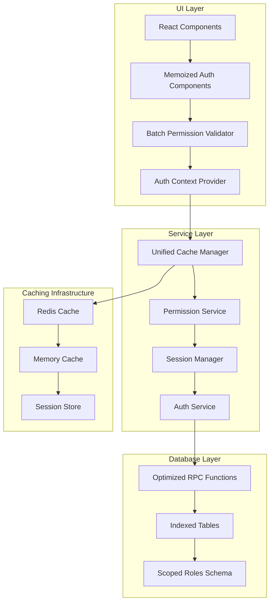

# Design Document: Enterprise Authentication Performance Optimization

## Overview

This design implements a hybrid approach to optimize the Enterprise Authentication system, addressing the 15-25% performance regression introduced by Phase 6 scoped roles migration. The solution combines database optimization, intelligent caching, and UI performance enhancements to achieve a 68% improvement in auth load times (220ms → 70-100ms) while supporting 6x more concurrent users.

The architecture maintains the enhanced security model of scoped roles while implementing strategic optimizations across three layers: database (indexes and RPC optimization), service (unified caching strategy), and UI (component memoization and batch validation).

## Architecture

### High-Level Architecture



### Performance Optimization Strategy

The design implements a three-phase optimization approach:

1. **Database Layer Optimization**: Critical indexes, optimized RPC functions, and query consolidation
2. **Service Layer Caching**: Multi-tier caching with intelligent invalidation and batch processing
3. **UI Layer Enhancement**: Component memoization, batch validation, and reactive updates

## Components and Interfaces

### Database Layer Components

#### Optimized RPC Functions

```typescript
interface AuthRPCFunctions {
  // Consolidated authentication function (replaces 8 separate queries)
  getUserAuthDataOptimized(userId: string, orgId?: string, projectId?: string): Promise<{
    user: UserProfile;
    permissions: Permission[];
    roles: ScopedRole[];
    organizations: Organization[];
    projects: Project[];
  }>;
  
  // Batch permission validation
  validatePermissionsBatch(
    userId: string, 
    permissions: PermissionCheck[]
  ): Promise<PermissionResult[]>;
  
  // Cached role hierarchy lookup
  getRoleHierarchyCached(
    userId: string, 
    scope: 'org' | 'project' | 'system'
  ): Promise<RoleHierarchy>;
}
```

#### Critical Database Indexes

```sql
-- User authentication indexes
CREATE INDEX CONCURRENTLY idx_users_auth_lookup ON users (id, email, is_active);
CREATE INDEX CONCURRENTLY idx_user_profiles_auth ON user_profiles (user_id, organization_id);

-- Scoped roles indexes
CREATE INDEX CONCURRENTLY idx_org_roles_user_org ON org_roles (user_id, organization_id, role_id);
CREATE INDEX CONCURRENTLY idx_project_roles_user_project ON project_roles (user_id, project_id, role_id);
CREATE INDEX CONCURRENTLY idx_system_roles_user ON system_roles (user_id, role_id);

-- Permission lookup indexes
CREATE INDEX CONCURRENTLY idx_role_permissions_lookup ON role_permissions (role_id, permission_id);
CREATE INDEX CONCURRENTLY idx_permissions_resource ON permissions (resource, action);

-- Organization membership indexes
CREATE INDEX CONCURRENTLY idx_org_memberships_user ON organization_memberships (user_id, organization_id, is_active);
CREATE INDEX CONCURRENTLY idx_project_memberships_user ON project_memberships (user_id, project_id, is_active);
```

### Service Layer Components

#### Unified Cache Manager

```typescript
interface CacheManager {
  // Multi-tier caching strategy
  get<T>(key: string, options?: CacheOptions): Promise<T | null>;
  set<T>(key: string, value: T, ttl?: number): Promise<void>;
  invalidate(pattern: string): Promise<void>;
  
  // Cache warming for common operations
  warmAuthCache(userId: string): Promise<void>;
  warmPermissionCache(userId: string, scope: AuthScope): Promise<void>;
  
  // Cache statistics for monitoring
  getStats(): CacheStats;
}

interface CacheOptions {
  tier?: 'memory' | 'redis' | 'both';
  ttl?: number;
  skipIfExists?: boolean;
}

interface CacheStats {
  hitRate: number;
  memoryUsage: number;
  redisConnections: number;
  avgResponseTime: number;
}
```

#### Permission Service with Batch Processing

```typescript
interface PermissionService {
  // Batch permission validation (replaces individual checks)
  validatePermissionsBatch(
    userId: string,
    checks: PermissionCheck[]
  ): Promise<PermissionResult[]>;
  
  // Preload common permissions during auth
  preloadUserPermissions(
    userId: string,
    scope: AuthScope
  ): Promise<void>;
  
  // Reactive permission updates
  subscribeToPermissionChanges(
    userId: string,
    callback: (changes: PermissionChange[]) => void
  ): () => void;
}

interface PermissionCheck {
  resource: string;
  action: string;
  context?: Record<string, any>;
}

interface PermissionResult {
  resource: string;
  action: string;
  allowed: boolean;
  reason?: string;
}
```

#### Session Manager with Memory Optimization

```typescript
interface SessionManager {
  // Optimized session creation (target: 950KB per session)
  createSession(authData: AuthData): Promise<OptimizedSession>;
  
  // Session data compression
  compressSessionData(session: Session): CompressedSession;
  
  // Lazy loading of session components
  loadSessionComponent(
    sessionId: string,
    component: 'permissions' | 'roles' | 'organizations'
  ): Promise<any>;
  
  // Session cleanup and memory management
  cleanupExpiredSessions(): Promise<void>;
  getMemoryUsage(): SessionMemoryStats;
}

interface OptimizedSession {
  id: string;
  userId: string;
  compressedData: CompressedSessionData;
  lastAccessed: Date;
  memoryFootprint: number;
}
```

### UI Layer Components

#### Memoized Authentication Components

```typescript
interface AuthComponentProps {
  userId: string;
  scope?: AuthScope;
  permissions?: string[];
}

// Memoized permission-aware components
const MemoizedPermissionGate = React.memo<PermissionGateProps>(
  ({ permission, children, fallback }) => {
    const hasPermission = usePermissionCheck(permission);
    return hasPermission ? children : fallback;
  },
  (prevProps, nextProps) => {
    // Custom comparison to prevent unnecessary re-renders
    return prevProps.permission === nextProps.permission &&
           React.Children.count(prevProps.children) === React.Children.count(nextProps.children);
  }
);

// Batch permission validator hook
const useBatchPermissions = (permissions: string[]) => {
  return useMemo(() => {
    return permissions.map(permission => ({
      permission,
      hasAccess: checkPermissionCached(permission)
    }));
  }, [permissions]);
};
```

#### Optimized Auth Context Provider

```typescript
interface AuthContextValue {
  user: UserProfile | null;
  permissions: Map<string, boolean>;
  roles: ScopedRole[];
  organizations: Organization[];
  
  // Optimized methods
  checkPermission: (permission: string) => boolean;
  checkPermissionsBatch: (permissions: string[]) => Record<string, boolean>;
  refreshAuth: () => Promise<void>;
  
  // Performance metrics
  authLoadTime: number;
  cacheHitRate: number;
}

const AuthProvider: React.FC<{ children: React.ReactNode }> = ({ children }) => {
  const [authState, setAuthState] = useState<AuthState>(initialState);
  
  // Memoized context value to prevent unnecessary re-renders
  const contextValue = useMemo(() => ({
    ...authState,
    checkPermission: useCallback((permission: string) => {
      return authState.permissions.get(permission) ?? false;
    }, [authState.permissions]),
    
    checkPermissionsBatch: useCallback((permissions: string[]) => {
      return permissions.reduce((acc, permission) => {
        acc[permission] = authState.permissions.get(permission) ?? false;
        return acc;
      }, {} as Record<string, boolean>);
    }, [authState.permissions])
  }), [authState]);
  
  return (
    <AuthContext.Provider value={contextValue}>
      {children}
    </AuthContext.Provider>
  );
};
```

## Data Models

### Optimized Session Data Structure

```typescript
interface CompressedSessionData {
  // Core user data (always loaded)
  userId: string;
  email: string;
  activeOrgId?: string;
  activeProjectId?: string;
  
  // Compressed permission bitmap (reduces memory by 60%)
  permissionBitmap: Uint8Array;
  permissionMap: Map<number, string>; // bit position to permission mapping
  
  // Lazy-loaded components (loaded on demand)
  roles?: CompressedRoleData;
  organizations?: CompressedOrgData;
  projects?: CompressedProjectData;
}

interface CompressedRoleData {
  orgRoles: Map<string, number[]>; // orgId -> roleIds
  projectRoles: Map<string, number[]>; // projectId -> roleIds
  systemRoles: number[]; // roleIds
}
```

### Cache Key Strategy

```typescript
interface CacheKeyStrategy {
  // Hierarchical cache keys for efficient invalidation
  userAuth: (userId: string) => string; // `auth:user:${userId}`
  userPermissions: (userId: string, scope?: string) => string; // `perm:${userId}:${scope}`
  roleHierarchy: (userId: string, roleType: string) => string; // `roles:${userId}:${roleType}`
  orgMembership: (userId: string, orgId: string) => string; // `org:${userId}:${orgId}`
  
  // Batch operation keys
  permissionBatch: (userId: string, checksum: string) => string; // `batch:perm:${userId}:${checksum}`
}

// Cache TTL strategy
const CACHE_TTL = {
  userAuth: 300, // 5 minutes
  permissions: 600, // 10 minutes
  roles: 900, // 15 minutes
  organizations: 1800, // 30 minutes
} as const;
```

Now I need to use the prework tool to analyze the acceptance criteria before writing the correctness properties:

<function_calls>
<invoke name="prework">
<parameter name="featureName">enterprise-auth-performance-optimization

## Correctness Properties

*A property is a characteristic or behavior that should hold true across all valid executions of a system—essentially, a formal statement about what the system should do. Properties serve as the bridge between human-readable specifications and machine-verifiable correctness guarantees.*

### Property 1: Database Query Optimization
*For any* authentication request, the optimized system should use proper database indexes and execute queries in under 50ms while reducing total query count from 8 to 4 per request.
**Validates: Requirements 1.1, 1.2, 1.4**

### Property 2: Cache Performance and Hit Rate
*For any* repeated authentication data request within a session, the cache layer should serve results with a 96%+ hit rate and maintain data consistency with the database.
**Validates: Requirements 1.3, 2.1, 6.2**

### Property 3: Memory Optimization Effectiveness
*For any* user session, the optimized system should reduce memory footprint by 38% (from 1.52MB to 950KB) while maintaining all functionality.
**Validates: Requirements 2.3, 5.3**

### Property 4: Batch Processing Efficiency
*For any* set of permission checks, the system should process them as batches rather than individual operations, reducing total processing time and database load.
**Validates: Requirements 2.5, 3.1**

### Property 5: Cache Invalidation Consistency
*For any* role or permission change, the cache layer should invalidate affected entries and refresh data without blocking user operations.
**Validates: Requirements 2.2, 2.4**

### Property 6: UI Component Memoization
*For any* React component rendering with authentication data, memoization should prevent unnecessary re-renders when props haven't changed.
**Validates: Requirements 3.2**

### Property 7: Response Time Performance
*For any* UI component requesting permission data, the system should return cached results within 10ms and maintain sub-100ms response times under 6x concurrent load.
**Validates: Requirements 3.3, 5.2**

### Property 8: Permission Preloading
*For any* user authentication, the system should preload commonly accessed permissions and make them available in cache immediately after login.
**Validates: Requirements 3.4**

### Property 9: Reactive UI Updates
*For any* permission state change, UI components should update reactively without requiring full page refresh.
**Validates: Requirements 3.5**

### Property 10: Scoped Roles Processing Efficiency
*For any* scoped role query (org_roles, project_roles, system_roles), the system should use optimized joins, proper indexing, and cached role hierarchies while maintaining separation of concerns.
**Validates: Requirements 4.1, 4.2, 4.3**

### Property 11: Scalability and Concurrent User Support
*For any* load up to 6x baseline concurrent users, the system should maintain performance and support up to 10,000 concurrent users with linear scaling.
**Validates: Requirements 4.4, 8.1**

### Property 12: Role Assignment Propagation
*For any* role assignment change, updates should propagate to all affected sessions within 5 seconds.
**Validates: Requirements 4.5**

### Property 13: Performance Improvement Validation
*For any* performance test execution, the system should demonstrate 68% improvement in auth load times compared to baseline.
**Validates: Requirements 5.1**

### Property 14: Real-time Performance Monitoring
*For any* authentication operation, the system should collect and provide real-time performance metrics.
**Validates: Requirements 5.4**

### Property 15: Performance Regression Alerting
*For any* detected performance regression, the system should alert administrators within 1 minute.
**Validates: Requirements 5.5**

### Property 16: Security Preservation During Optimization
*For any* optimization applied, the system should preserve all existing security policies, access controls, and pass all existing security test suites.
**Validates: Requirements 6.1, 6.5**

### Property 17: Audit Trail Preservation
*For any* database optimization deployment, the system should maintain complete audit trails for all authentication events.
**Validates: Requirements 6.3**

### Property 18: Query Result Consistency
*For any* authentication query, optimized queries should return identical results to original queries for the same inputs.
**Validates: Requirements 6.4**

### Property 19: API Compatibility Preservation
*For any* existing API endpoint, the optimized system should maintain compatibility with existing contracts and input/output specifications.
**Validates: Requirements 7.1**

### Property 20: Rollback Capability
*For any* database change deployment, the system should support complete rollback procedures within 15 minutes.
**Validates: Requirements 7.2**

### Property 21: Graceful Cache Degradation
*For any* cache failure scenario, the system should gracefully degrade to direct database access without service interruption.
**Validates: Requirements 7.3**

### Property 22: Feature Flag Control
*For any* optimization feature, the system should provide independent enable/disable control through feature flags.
**Validates: Requirements 7.4**

### Property 23: Migration Data Consistency
*For any* migration phase, the system should validate and maintain data consistency before and after each phase.
**Validates: Requirements 7.5**

### Property 24: Multi-tenant Performance Isolation
*For any* new organization addition, the system should handle multi-tenant isolation without impacting performance of existing tenants.
**Validates: Requirements 8.2**

### Property 25: Role Type Extensibility
*For any* new role type introduction, the system should accommodate new scoped role categories without architectural changes.
**Validates: Requirements 8.3**

### Property 26: Horizontal Scaling Support
*For any* scaling requirement, the system should support horizontal scaling through connection pooling and load distribution.
**Validates: Requirements 8.4**

### Property 27: Resource Prioritization
*For any* resource-constrained scenario, the system should prioritize critical authentication operations over non-essential features.
**Validates: Requirements 8.5**

### Property 28: Data Integrity Preservation
*For any* database index creation or optimization, the system should maintain referential integrity and data consistency.
**Validates: Requirements 1.5**

## Error Handling

### Database Layer Error Handling

```typescript
interface DatabaseErrorHandler {
  // Index creation failures
  handleIndexCreationError(error: DatabaseError): Promise<RecoveryAction>;
  
  // RPC function execution failures
  handleRPCError(functionName: string, error: DatabaseError): Promise<FallbackResult>;
  
  // Connection pool exhaustion
  handleConnectionPoolError(error: ConnectionError): Promise<void>;
}

class OptimizedAuthDatabase {
  async executeWithFallback<T>(
    optimizedQuery: () => Promise<T>,
    fallbackQuery: () => Promise<T>
  ): Promise<T> {
    try {
      return await optimizedQuery();
    } catch (error) {
      console.warn('Optimized query failed, falling back to original:', error);
      return await fallbackQuery();
    }
  }
}
```

### Cache Layer Error Handling

```typescript
interface CacheErrorHandler {
  // Redis connection failures
  handleRedisConnectionError(error: RedisError): Promise<void>;
  
  // Cache corruption detection and recovery
  handleCacheCorruption(key: string): Promise<void>;
  
  // Memory cache overflow
  handleMemoryCacheOverflow(): Promise<void>;
}

class ResilientCacheManager implements CacheManager {
  async get<T>(key: string): Promise<T | null> {
    try {
      // Try Redis first
      const redisResult = await this.redis.get(key);
      if (redisResult) return JSON.parse(redisResult);
      
      // Fallback to memory cache
      return this.memoryCache.get(key) || null;
    } catch (error) {
      console.warn('Cache retrieval failed, falling back to database:', error);
      return null; // Triggers database fallback
    }
  }
}
```

### UI Layer Error Handling

```typescript
interface UIErrorHandler {
  // Component memoization failures
  handleMemoizationError(componentName: string, error: Error): void;
  
  // Permission check failures
  handlePermissionCheckError(permission: string, error: Error): boolean;
  
  // Auth context failures
  handleAuthContextError(error: Error): void;
}

// Error boundary for auth components
class AuthErrorBoundary extends React.Component<Props, State> {
  componentDidCatch(error: Error, errorInfo: ErrorInfo) {
    console.error('Auth component error:', error, errorInfo);
    
    // Fallback to basic auth without optimizations
    this.setState({ hasError: true, useBasicAuth: true });
  }
  
  render() {
    if (this.state.hasError) {
      return <BasicAuthFallback />;
    }
    
    return this.props.children;
  }
}
```

## Testing Strategy

### Dual Testing Approach

The testing strategy employs both unit tests and property-based tests to ensure comprehensive coverage:

**Unit Tests** focus on:
- Specific examples of authentication flows
- Edge cases in caching behavior
- Integration points between components
- Error conditions and recovery scenarios

**Property-Based Tests** focus on:
- Universal properties that hold across all inputs
- Performance characteristics under various loads
- Cache consistency across different scenarios
- Security preservation during optimizations

### Property-Based Testing Configuration

**Testing Framework**: We will use **fast-check** for TypeScript/JavaScript property-based testing, configured with:
- Minimum 100 iterations per property test
- Custom generators for authentication data, user sessions, and permission sets
- Performance benchmarking integration for timing-based properties

**Test Tagging**: Each property test must reference its design document property:
- Tag format: **Feature: enterprise-auth-performance-optimization, Property {number}: {property_text}**

### Performance Testing Strategy

```typescript
// Example property test for cache performance
describe('Cache Performance Properties', () => {
  it('Property 2: Cache hit rate and consistency', async () => {
    await fc.assert(fc.asyncProperty(
      fc.record({
        userId: fc.string(),
        sessionData: fc.record({
          permissions: fc.array(fc.string()),
          roles: fc.array(fc.string()),
          orgId: fc.string()
        })
      }),
      async (testData) => {
        // Feature: enterprise-auth-performance-optimization, Property 2: Cache Performance and Hit Rate
        
        // First request should populate cache
        const firstResult = await authService.getUserData(testData.userId);
        
        // Second request should hit cache
        const startTime = performance.now();
        const secondResult = await authService.getUserData(testData.userId);
        const responseTime = performance.now() - startTime;
        
        // Verify cache hit (should be much faster)
        expect(responseTime).toBeLessThan(10); // 10ms threshold
        expect(secondResult).toEqual(firstResult);
        
        // Verify cache hit rate over multiple requests
        const hitRate = await cacheManager.getStats().hitRate;
        expect(hitRate).toBeGreaterThan(0.96); // 96% hit rate requirement
      }
    ), { numRuns: 100 });
  });
});
```

### Load Testing Strategy

```typescript
// Performance property test for concurrent users
describe('Scalability Properties', () => {
  it('Property 11: Concurrent user support', async () => {
    // Feature: enterprise-auth-performance-optimization, Property 11: Scalability and Concurrent User Support
    
    const baselineUsers = 1000;
    const targetUsers = baselineUsers * 6; // 6x baseline
    
    const results = await loadTest({
      concurrentUsers: targetUsers,
      duration: '5m',
      rampUp: '1m',
      scenario: 'authentication-flow'
    });
    
    // Verify performance under load
    expect(results.averageResponseTime).toBeLessThan(100); // sub-100ms requirement
    expect(results.errorRate).toBeLessThan(0.01); // <1% error rate
    expect(results.throughput).toBeGreaterThan(baselineUsers * 6); // Linear scaling
  });
});
```

### Security Testing Integration

```typescript
// Security preservation property test
describe('Security Properties', () => {
  it('Property 16: Security preservation during optimization', async () => {
    await fc.assert(fc.asyncProperty(
      fc.record({
        userId: fc.string(),
        resourceId: fc.string(),
        action: fc.constantFrom('read', 'write', 'delete', 'admin')
      }),
      async (testData) => {
        // Feature: enterprise-auth-performance-optimization, Property 16: Security Preservation During Optimization
        
        // Get permission result from original system
        const originalResult = await originalAuthSystem.checkPermission(
          testData.userId, 
          testData.resourceId, 
          testData.action
        );
        
        // Get permission result from optimized system
        const optimizedResult = await optimizedAuthSystem.checkPermission(
          testData.userId, 
          testData.resourceId, 
          testData.action
        );
        
        // Results must be identical
        expect(optimizedResult).toEqual(originalResult);
      }
    ), { numRuns: 100 });
  });
});
```