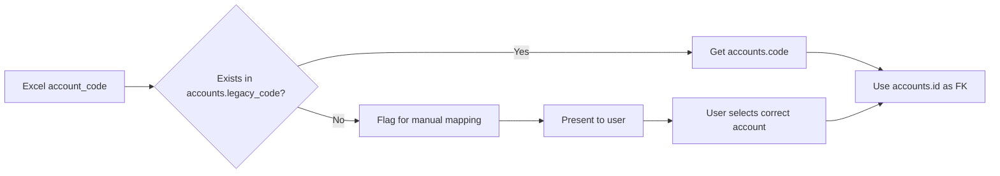

# Design Document: Excel Data Migration to Supabase (UPDATED)

## Document Revision History

- **Version 1.0**: Initial design document
- **Version 2.0**: Updated based on pre-implementation analysis (2026-02-13)

## Critical Clarifications (From User)

### Environment & Configuration
1. **Supabase column names**: English (not Arabic)
2. **Database access**: Agent has direct access to Supabase to retrieve schema
3. **Primary keys**: UUID (confirmed via inspection needed)
4. **Existing data**: Database is empty OR existing data will be deleted before migration
5. **Environment**: Production only (no staging/test environment)

### Data Mapping Strategy
1. **Account code mapping**: Already mapped in Supabase (legacy_code field populated)
2. **Unmapped codes handling**: Refer to user for manual selection if any unmapped codes found
3. **Excel column mapping**: User will provide manual mapping for precise alignment
4. **Dimensions support**: Supabase `transaction_lines` has ALL required dimension columns (project, work_analysis, sub_tree)

### Excel File Structure
1. **Primary sheet**: "transactions " (with trailing space) - 14,224 records
2. **Reference sheets**: 
   - "codes" sheet - not needed for migration
   - "trial" sheet - use for verification only
3. **Data structure**: Transaction lines only (no separate transaction headers in Excel)
4. **Headers**: Row 0 contains Arabic headers, data starts from row 1

## Excel Data Analysis Results

### File Statistics
- **Total records**: 14,224 transaction lines
- **Unique transactions**: 2,164 (grouped by entry_no)
- **Unique account codes**: 21
- **Unique project codes**: 5
- **Date range**: 2022-05-17 to 2025-12-31
- **Balanced transactions**: 2,130 / 2,164 (98.4%)
- **Unbalanced transactions**: 34 (1.6% - REQUIRES INVESTIGATION)

### Excel Column Mapping

| # | Excel Column (Arabic) | English Name | Required | Supabase Table | Supabase Column |
|---|----------------------|--------------|----------|----------------|-----------------|
| 1 | العام المالى | fiscal_year | Yes | transactions | fiscal_year |
| 2 | الشهر | month | Yes | transactions | month |
| 3 | entry no | entry_no | Yes | transactions | reference_number |
| 4 | entry date | entry_date | Yes | transactions | transaction_date |
| 5 | account code | account_code | Yes | transaction_lines | account_id (FK) |
| 6 | account name | account_name | No | - | (derived from accounts) |
| 7 | transaction classification code | transaction_classification_code | Yes | transaction_lines | classification_id (FK) |
| 8 | classification code | classification_code | Yes | transaction_lines | classification_code |
| 9 | classification name | classification_name | No | - | (derived from classifications) |
| 10 | project code | project_code | Yes | transaction_lines | project_id (FK) |
| 11 | project name | project_name | No | - | (derived from projects) |
| 12 | work analysis code | work_analysis_code | Yes | transaction_lines | work_analysis_id (FK) |
| 13 | work analysis name | work_analysis_name | No | - | (derived) |
| 14 | sub_tree code | sub_tree_code | Yes | transaction_lines | sub_tree_id (FK) |
| 15 | sub_tree name | sub_tree_name | No | - | (derived) |
| 16 | مدين | debit | Yes | transaction_lines | debit_amount |
| 17 | دائن | credit | Yes | transaction_lines | credit_amount |
| 18 | ملاحظات | notes | No | transaction_lines | notes |

**Note**: Column names in "Supabase Column" are placeholders - actual names to be retrieved via schema inspection.

## Architecture Updates

### Data Transformation Strategy

Since Excel contains only transaction LINES (no separate headers), the migration must:

1. **Group Excel rows** by `(entry_no, entry_date)` to identify unique transactions
2. **Create transaction headers** in Supabase `transactions` table:
   - `reference_number` = entry_no
   - `transaction_date` = entry_date
   - `fiscal_year` = fiscal_year (from Excel)
   - `month` = month (from Excel)
   - `total_debit` = SUM(debit) for all lines in transaction
   - `total_credit` = SUM(credit) for all lines in transaction
   - `notes` = Aggregated notes from lines (if any)
3. **Create transaction lines** in Supabase `transaction_lines` table:
   - One row per Excel record
   - Link to parent transaction via `transaction_id` (FK)

### Account Code Mapping Flow



## Updated Component Interfaces

### ExcelReader Enhancement

```python
class ExcelReader:
    def __init__(self, file_path: str):
        self.file_path = file_path
        self.column_mapping = {
            'العام المالى': 'fiscal_year',
            'الشهر': 'month',
            'entry no': 'entry_no',
            'entry date': 'entry_date',
            'account code': 'account_code',
            'account name': 'account_name',
            'transaction classification code': 'transaction_classification_code',
            'classification code': 'classification_code',
            'classification name': 'classification_name',
            'project code': 'project_code',
            'project name': 'project_name',
            'work analysis code': 'work_analysis_code',
            'work analysis name': 'work_analysis_name',
            'sub_tree code': 'sub_tree_code',
            'sub_tree name': 'sub_tree_name',
            'مدين': 'debit',
            'دائن': 'credit',
            'ملاحظات': 'notes'
        }
    
    def read_transactions(self) -> pd.DataFrame:
        """
        Read transactions sheet with proper header handling.
        Skips row 0 (Arabic headers), uses row 1 as data start.
        Returns DataFrame with English column names.
        """
        pass
    
    def validate_structure(self) -> ValidationResult:
        """
        Validates that all expected columns exist.
        Checks for data quality issues.
        """
        pass
```

### TransactionGrouper (NEW Component)

```python
class TransactionGrouper:
    """
    Groups transaction lines by entry_no to create transaction headers.
    """
    
    def group_lines_into_transactions(self, lines_df: pd.DataFrame) -> Tuple[pd.DataFrame, pd.DataFrame]:
        """
        Groups Excel rows by (entry_no, entry_date).
        
        Returns:
            - transactions_df: DataFrame with transaction headers
            - lines_df: DataFrame with transaction lines (unchanged, but with transaction grouping info)
        """
        pass
    
    def validate_transaction_balance(self, grouped_df: pd.DataFrame) -> List[ValidationError]:
        """
        For each transaction group:
        - Calculate total_debit = SUM(debit)
        - Calculate total_credit = SUM(credit)
        - Assert total_debit == total_credit
        - Return list of unbalanced transactions
        """
        pass
```

### AccountCodeMapper Enhancement

```python
class AccountCodeMapper:
    def __init__(self, supabase_client: Client):
        self.supabase_client = supabase_client
        self.accounts_cache = None  # Cache all accounts on init
        
    def load_accounts_cache(self):
        """
        Loads ALL accounts from Supabase into memory:
        - id, code, name, legacy_code, legacy_name
        """
        pass
    
    def map_excel_code_to_account_id(self, excel_code: str) -> Optional[str]:
        """
        Maps Excel account code to Supabase account UUID.
        
        Logic:
        1. Search for excel_code in accounts.legacy_code
        2. If found, return accounts.id (UUID)
        3. If not found, return None
        """
        pass
    
    def get_unmapped_codes(self, excel_codes: List[str]) -> List[str]:
        """
        Returns list of Excel codes that don't have legacy_code mapping.
        """
        pass
    
    def prompt_user_for_mapping(self, unmapped_code: str) -> str:
        """
        Interactive prompt for user to select correct account.
        Shows list of available accounts with code and name.
        Returns selected account_id (UUID).
        """
        pass
```

## Critical Validation Rules (UPDATED)

### Property 16: Transaction Balance Integrity (NEW)

**Property**: *For any* transaction group in Excel (grouped by entry_no and entry_date), 
the sum of all debit amounts MUST equal the sum of all credit amounts within 0.01 tolerance.

**Validation**: 
- Run on Excel data BEFORE migration
- Generate report of unbalanced transactions (34 found in current data)
- REQUIRE user review and correction before proceeding

**Failure Action**: 
- STOP migration if unbalanced transactions exist
- Generate report with entry_no, total_debit, total_credit, difference
- User must fix in Excel or approve override

### Property 17: Account Code Completeness (NEW)

**Property**: *For any* unique account code in Excel, there MUST exist a corresponding 
`legacy_code` entry in Supabase `accounts` table.

**Validation**:
- Extract 21 unique account codes from Excel
- Query Supabase for matching legacy_codes
- Generate unmapped codes report

**Failure Action**:
- If any unmapped codes found → STOP and present to user
- User provides manual mapping via interactive prompt
- Update mapping table and retry validation

## Migration Phases (UPDATED)

### Phase 0: Pre-Implementation Discovery (MANDATORY - BEFORE TASK 1)

```markdown
- [ ] 0.1 Supabase Schema Inspection
  - Connect to Supabase using provided credentials
  - Retrieve complete schema for tables:
    * accounts (id, code, name, legacy_code, legacy_name)
    * transactions (all columns and types)
    * transaction_lines (all columns and types)
    * projects, classifications, work_analysis, sub_tree (if separate tables)
  - Export schema to JSON: reports/supabase_schema.json
  - Generate human-readable schema document: reports/supabase_schema.md

- [ ] 0.2 Excel Structure Validation
  - Verify "transactions " sheet exists
  - Verify all 18 expected columns present
  - Check for data quality issues (missing values, wrong types)
  - Generate Excel structure report: reports/excel_structure.json

- [ ] 0.3 Column Mapping Matrix Creation
  - Create CSV with columns: Excel_Column, English_Name, Supabase_Table, Supabase_Column, Data_Type
  - Present to user for review and approval
  - Save approved mapping: config/column_mapping.csv

- [ ] 0.4 Account Code Verification
  - Extract 21 unique account codes from Excel
  - Query Supabase for ALL accounts with legacy_code
  - Generate mapping report: reports/account_mapping.csv
  - Identify unmapped codes (if any)
  - IF unmapped codes exist:
    * Present to user for manual selection
    * Update mapping table
    * Re-verify until 100% mapped

- [ ] 0.5 Transaction Balance Audit
  - Group Excel rows by entry_no
  - Calculate total_debit and total_credit per group
  - Identify 34 unbalanced transactions
  - Generate unbalanced transactions report: reports/unbalanced_transactions.csv
  - Present to user:
    * Option A: Fix in Excel and re-upload
    * Option B: Approve override (document risk)
  - REQUIRE user decision before proceeding

- [ ] 0.6 Data Profiling Report
  - Record count: 14,224 lines, 2,164 transactions
  - Date range: 2022-05-17 to 2025-12-31
  - Account distribution (count per account code)
  - Project distribution (count per project code)
  - Missing value analysis
  - Generate: reports/data_profile.json

- [ ] 0.7 Migration Feasibility Report
  - Summarize findings from 0.1-0.6
  - List all blocking issues (if any)
  - List all warnings
  - Provide go/no-go recommendation
  - Generate: reports/feasibility_report.md
  - REQUIRE user approval before Phase 1
```

### Phase 1-5: (Unchanged from original plan, execute after Phase 0 approval)

## Error Handling (UPDATED)

### Unbalanced Transaction Handling

```python
class UnbalancedTransactionError(Exception):
    """Raised when transaction debits != credits"""
    def __init__(self, entry_no: str, total_debit: float, total_credit: float):
        self.entry_no = entry_no
        self.total_debit = total_debit
        self.total_credit = total_credit
        self.difference = total_debit - total_credit
        super().__init__(
            f"Transaction {entry_no} is unbalanced: "
            f"Debits={total_debit:.2f}, Credits={total_credit:.2f}, "
            f"Difference={self.difference:.2f}"
        )
```

**Handling Strategy**:
1. **Validation Phase**: Detect all unbalanced transactions
2. **User Decision**: 
   - Fix in Excel (recommended)
   - Approve override with documentation (risk accepted)
3. **Migration Phase**: If override approved, add balancing entry automatically:
   - If debit > credit: Add credit line to suspense account
   - If credit > debit: Add debit line to suspense account
   - Log all auto-balancing entries for audit

### Unmapped Account Code Handling

```python
class UnmappedAccountCodeError(Exception):
    """Raised when Excel account code has no legacy_code mapping"""
    def __init__(self, excel_code: str):
        self.excel_code = excel_code
        super().__init__(f"Account code {excel_code} not found in Supabase legacy_code field")
```

**Handling Strategy**:
1. **Validation Phase**: Detect all unmapped codes
2. **Interactive Prompt**:
   ```
   Unmapped account code: 134
   Excel account name: العملاء
   
   Available accounts in Supabase:
   1. [UUID-001] Code: 1341 | Name: Customer Accounts | Legacy: 134
   2. [UUID-002] Code: 1342 | Name: Client Receivables | Legacy: 135
   3. [Skip this record]
   
   Select account (1-3): _
   ```
3. **Save Mapping**: Store manual mappings to avoid re-prompting
4. **Retry**: Re-run validation until 100% mapped

## Testing Strategy (UPDATED)

### Phase 0 Testing

```python
# test_phase0_discovery.py

def test_supabase_connection():
    """Verify Supabase connection and credentials"""
    pass

def test_schema_retrieval():
    """Verify all required tables and columns exist"""
    pass

def test_excel_file_access():
    """Verify Excel file can be opened and read"""
    pass

def test_column_mapping_completeness():
    """Verify all Excel columns have Supabase mappings"""
    pass

def test_account_code_mapping():
    """Verify all 21 Excel codes have legacy_code mappings"""
    pass

def test_transaction_balance():
    """Verify all transactions are balanced"""
    pass
```

### Integration Test with Sample Data

```python
# test_migration_integration.py

def test_full_migration_with_sample():
    """
    Test full migration with first 100 records:
    1. Group lines into transactions
    2. Map account codes
    3. Create transactions and lines in test database
    4. Verify referential integrity
    5. Verify balance integrity
    6. Rollback test database
    """
    pass
```

## Risk Assessment (UPDATED)

### Critical Risks (Must Address Before Phase 1)

| Risk | Severity | Likelihood | Mitigation |
|------|----------|------------|------------|
| 34 unbalanced transactions in Excel | HIGH | 100% (confirmed) | Phase 0.5: User must review and fix or approve override |
| Unmapped account codes | HIGH | LOW (user confirmed pre-mapped) | Phase 0.4: Verify 100% coverage, provide manual mapping if needed |
| Production-only environment | HIGH | 100% | Phase 0: Comprehensive validation + dry-run mandatory |
| Column mapping misalignment | MEDIUM | MEDIUM | Phase 0.3: User approval required on mapping matrix |

### Medium Risks

| Risk | Severity | Likelihood | Mitigation |
|------|----------|------------|------------|
| Database write failures during migration | MEDIUM | LOW | Backup + transaction batching + retry logic |
| Data type conversion errors | MEDIUM | MEDIUM | Phase 0: Data profiling + validation rules |
| Memory issues with 14K records | LOW | LOW | Batch processing (100 records/batch) |

## Documentation Deliverables (UPDATED)

### Phase 0 Reports (NEW)

1. **reports/supabase_schema.json**: Complete database schema
2. **reports/supabase_schema.md**: Human-readable schema documentation
3. **reports/excel_structure.json**: Excel file structure analysis
4. **config/column_mapping.csv**: Approved Excel-to-Supabase column mappings
5. **reports/account_mapping.csv**: Excel code → Supabase account UUID mappings
6. **reports/unbalanced_transactions.csv**: List of 34 unbalanced transactions with details
7. **reports/data_profile.json**: Statistical profile of Excel data
8. **reports/feasibility_report.md**: Go/no-go recommendation with risk assessment

### Phase 1-5 Reports (Unchanged)

All reports from original design document apply.

## Next Steps

1. **User Action Required**: Review and approve this updated design document
2. **User Action Required**: Provide Supabase credentials (.env file or configuration)
3. **Agent Action**: Implement Phase 0 scripts (Tasks 0.1-0.7)
4. **User Action Required**: Review Phase 0 reports and approve/reject
5. **Agent Action**: If approved, proceed to Phase 1 (Project Setup)

## Appendix A: Excel Column Details

### Column Analysis

| Column | Type | Non-Null | Null | Notes |
|--------|------|----------|------|-------|
| fiscal_year | int | 14,162 | 63 | 63 rows missing fiscal year |
| month | int | 14,162 | 63 | 63 rows missing month |
| entry_no | int | 14,162 | 63 | 2,164 unique transaction numbers |
| entry_date | datetime | 14,162 | 63 | Range: 2022-05-17 to 2025-12-31 |
| account_code | float | 14,162 | 63 | 21 unique codes |
| account_name | str | 14,162 | 63 | Arabic names |
| transaction_classification_code | float | 13,744 | 481 | 481 rows missing classification |
| classification_code | str | 13,744 | 481 | Linked to classification_code |
| classification_name | str | 14,162 | 63 | Arabic names |
| project_code | float | 14,162 | 63 | 5 unique projects |
| project_name | str | 14,161 | 64 | Arabic names, 1 extra null |
| work_analysis_code | float | 13,370 | 855 | 855 rows missing work analysis |
| work_analysis_name | str | 13,370 | 855 | Arabic names |
| sub_tree_code | float | 14,152 | 73 | 73 rows missing sub_tree |
| sub_tree_name | str | 14,152 | 73 | Arabic names |
| debit | float | 11,279 | 2,946 | Either debit OR credit per row |
| credit | float | 2,881 | 11,344 | Either debit OR credit per row |
| notes | str | 8 | 14,217 | Rarely used |

**Key Findings**:
- 63 rows appear to be missing core data (fiscal_year, month, entry_no, entry_date, account_code) - investigate
- Debit/Credit are mutually exclusive (as expected)
- Optional dimensions have varying null rates: classification (3.4%), work_analysis (6.0%), sub_tree (0.5%)

## Appendix B: Account Code List

Excel contains these 21 unique account codes:
```
31, 41, 56, 115, 116, 117, 131, 132, 134, 211, 221, 232, 233, 234, 236, 
1352, 1354, 2352, 2356, 13111, 23111
```

All codes must be verified against Supabase `accounts.legacy_code` in Phase 0.4.
