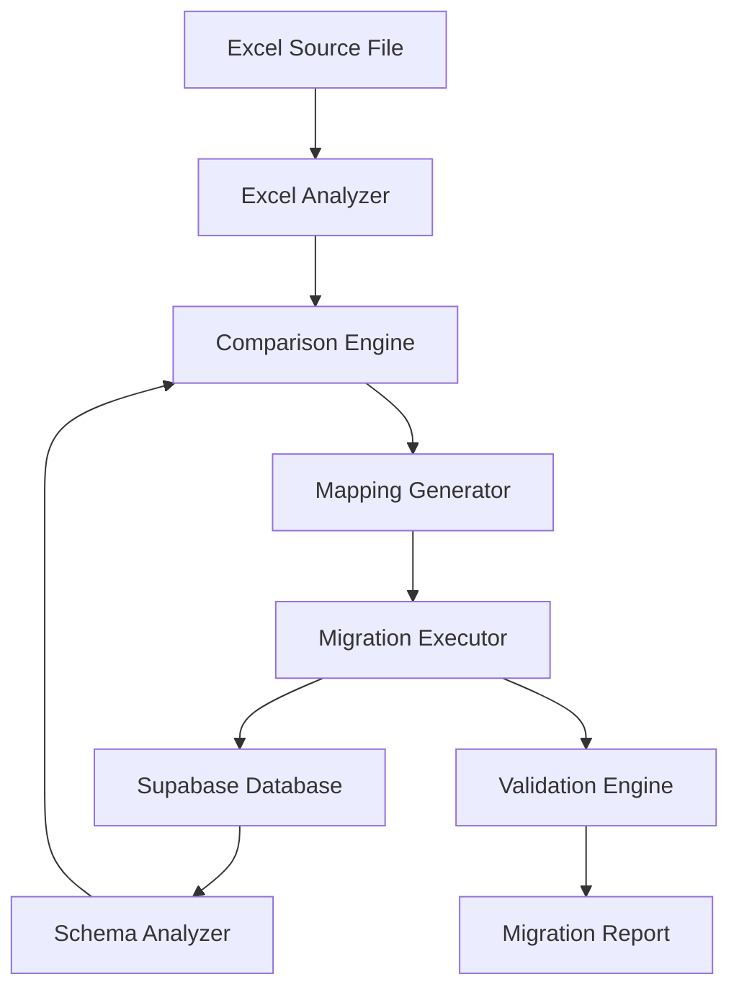
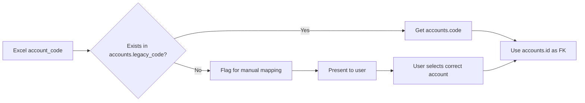

# Design Document: Excel Data Migration to Supabase

## Document Revision History

- **Version 1.0**: Initial design document
- **Version 2.0**: Updated based on pre-implementation analysis (2026-02-13)

## Critical Clarifications (From User)

### Environment & Configuration
1. **Supabase column names**: English (not Arabic)
2. **Database access**: Agent has direct access to Supabase to retrieve schema
3. **Primary keys**: UUID (confirmed via inspection needed)
4. **Existing data**: Database is empty OR existing data will be deleted before migration
5. **Environment**: Production only (no staging/test environment)

### Data Mapping Strategy
1. **Account code mapping**: Already mapped in Supabase (legacy_code field populated)
2. **Unmapped codes handling**: Refer to user for manual selection if any unmapped codes found
3. **Excel column mapping**: User will provide manual mapping for precise alignment
4. **Dimensions support**: Supabase `transaction_lines` has ALL required dimension columns (project, work_analysis, sub_tree)

### Excel File Structure
1. **Primary sheet**: "transactions " (with trailing space) - 14,224 records
2. **Reference sheets**: 
   - "codes" sheet - not needed for migration
   - "trial" sheet - use for verification only
3. **Data structure**: Transaction lines only (no separate transaction headers in Excel)
4. **Headers**: Row 0 contains Arabic headers, data starts from row 1

## Excel Data Analysis Results

### File Statistics
- **Total records**: 14,224 transaction lines
- **Unique transactions**: 2,164 (grouped by entry_no)
- **Unique account codes**: 21
- **Unique project codes**: 5
- **Date range**: 2022-05-17 to 2025-12-31
- **Balanced transactions**: 2,130 / 2,164 (98.4%)
- **Unbalanced transactions**: 34 (1.6% - REQUIRES INVESTIGATION)

### Excel Column Mapping

| # | Excel Column (Arabic) | English Name | Required | Supabase Table | Supabase Column |
|---|----------------------|--------------|----------|----------------|-----------------|
| 1 | العام المالى | fiscal_year | Yes | transactions | fiscal_year |
| 2 | الشهر | month | Yes | transactions | month |
| 3 | entry no | entry_no | Yes | transactions | reference_number |
| 4 | entry date | entry_date | Yes | transactions | transaction_date |
| 5 | account code | account_code | Yes | transaction_lines | account_id (FK) |
| 6 | account name | account_name | No | - | (derived from accounts) |
| 7 | transaction classification code | transaction_classification_code | Yes | transaction_lines | classification_id (FK) |
| 8 | classification code | classification_code | Yes | transaction_lines | classification_code |
| 9 | classification name | classification_name | No | - | (derived from classifications) |
| 10 | project code | project_code | Yes | transaction_lines | project_id (FK) |
| 11 | project name | project_name | No | - | (derived from projects) |
| 12 | work analysis code | work_analysis_code | Yes | transaction_lines | work_analysis_id (FK) |
| 13 | work analysis name | work_analysis_name | No | - | (derived) |
| 14 | sub_tree code | sub_tree_code | Yes | transaction_lines | sub_tree_id (FK) |
| 15 | sub_tree name | sub_tree_name | No | - | (derived) |
| 16 | مدين | debit | Yes | transaction_lines | debit_amount |
| 17 | دائن | credit | Yes | transaction_lines | credit_amount |
| 18 | ملاحظات | notes | No | transaction_lines | notes |

**Note**: Column names in "Supabase Column" are placeholders - actual names to be retrieved via schema inspection.

## Overview

This design document outlines the technical approach for migrating accounting data from an Excel file to a Supabase production database. The migration system consists of three main Python scripts: a Supabase schema analyzer, an Excel structure analyzer, and a migration executor. The design emphasizes data integrity, reversibility, and comprehensive validation throughout the migration process.

## Architecture

### System Components



### Data Transformation Strategy

Since Excel contains only transaction LINES (no separate headers), the migration must:

1. **Group Excel rows** by `(entry_no, entry_date)` to identify unique transactions
2. **Create transaction headers** in Supabase `transactions` table:
   - `reference_number` = entry_no
   - `transaction_date` = entry_date
   - `fiscal_year` = fiscal_year (from Excel)
   - `month` = month (from Excel)
   - `total_debit` = SUM(debit) for all lines in transaction
   - `total_credit` = SUM(credit) for all lines in transaction
   - `notes` = Aggregated notes from lines (if any)
3. **Create transaction lines** in Supabase `transaction_lines` table:
   - One row per Excel record
   - Link to parent transaction via `transaction_id` (FK)

### Account Code Mapping Flow



### Component Responsibilities

1. **Schema Analyzer**: Connects to Supabase and extracts complete schema information including tables, columns, data types, constraints, and relationships.

2. **Excel Analyzer**: Reads the Excel file and analyzes its structure, identifying sheets, columns, data types, and accounting dimensions.

3. **Comparison Engine**: Compares Excel and Supabase structures to identify mappings, mismatches, and migration requirements.

4. **Mapping Generator**: Creates account code mappings from Excel codes to Supabase codes using legacy_code references.

5. **Migration Executor**: Performs the actual data migration with batch processing, error handling, and transaction management.

6. **Validation Engine**: Validates data before and after migration to ensure integrity and completeness.

### Technology Stack

- **Language**: Python 3.8+
- **Supabase Client**: `supabase-py` library
- **Excel Processing**: `openpyxl` or `pandas` library
- **Configuration**: `python-dotenv` for environment variables
- **Logging**: Python `logging` module
- **Data Validation**: `pydantic` for data models

## Components and Interfaces

### 1. Supabase Connection Manager

```python
class SupabaseConnectionManager:
    def __init__(self, url: str, key: str)
    def connect() -> Client
    def test_connection() -> bool
    def get_table_schema(table_name: str) -> Dict
    def get_all_relationships() -> List[Relationship]
```

**Purpose**: Manages connection to Supabase and provides schema introspection capabilities.

### 2. Schema Analyzer

```python
class SchemaAnalyzer:
    def __init__(self, connection_manager: SupabaseConnectionManager)
    def analyze_accounts_table() -> TableSchema
    def analyze_transactions_table() -> TableSchema
    def analyze_transaction_lines_table() -> TableSchema
    def get_foreign_keys() -> List[ForeignKey]
    def generate_schema_report() -> SchemaReport
```

**Purpose**: Analyzes Supabase database schema and extracts structural information.

### 3. Excel Reader

```python
class ExcelReader:
    def __init__(self, file_path: str):
        self.file_path = file_path
        self.column_mapping = {
            'العام المالى': 'fiscal_year',
            'الشهر': 'month',
            'entry no': 'entry_no',
            'entry date': 'entry_date',
            'account code': 'account_code',
            'account name': 'account_name',
            'transaction classification code': 'transaction_classification_code',
            'classification code': 'classification_code',
            'classification name': 'classification_name',
            'project code': 'project_code',
            'project name': 'project_name',
            'work analysis code': 'work_analysis_code',
            'work analysis name': 'work_analysis_name',
            'sub_tree code': 'sub_tree_code',
            'sub_tree name': 'sub_tree_name',
            'مدين': 'debit',
            'دائن': 'credit',
            'ملاحظات': 'notes'
        }
    
    def read_transactions(self) -> pd.DataFrame:
        """
        Read transactions sheet with proper header handling.
        Skips row 0 (Arabic headers), uses row 1 as data start.
        Returns DataFrame with English column names.
        """
        pass
    
    def validate_structure(self) -> ValidationResult:
        """
        Validates that all expected columns exist.
        Checks for data quality issues.
        """
        pass
```

**Purpose**: Reads Excel file and provides access to its contents with proper Arabic header handling.

### 4. Excel Structure Analyzer

```python
class ExcelStructureAnalyzer:
    def __init__(self, excel_reader: ExcelReader)
    def analyze_structure() -> ExcelStructure
    def identify_accounting_dimensions() -> List[Dimension]
    def detect_data_types() -> Dict[str, DataType]
    def generate_structure_report() -> StructureReport
```

**Purpose**: Analyzes Excel file structure and identifies data patterns.

### 5. Data Comparator

```python
class DataComparator:
    def __init__(self, excel_structure: ExcelStructure, schema: SchemaReport)
    def compare_structures() -> ComparisonResult
    def identify_field_mappings() -> Dict[str, str]
    def identify_mismatches() -> List[Mismatch]
    def generate_comparison_report() -> ComparisonReport
```

**Purpose**: Compares Excel and Supabase structures to identify mappings and gaps.

### 6. Transaction Grouper (NEW Component)

```python
class TransactionGrouper:
    """
    Groups transaction lines by entry_no to create transaction headers.
    """
    
    def group_lines_into_transactions(self, lines_df: pd.DataFrame) -> Tuple[pd.DataFrame, pd.DataFrame]:
        """
        Groups Excel rows by (entry_no, entry_date).
        
        Returns:
            - transactions_df: DataFrame with transaction headers
            - lines_df: DataFrame with transaction lines (unchanged, but with transaction grouping info)
        """
        pass
    
    def validate_transaction_balance(self, grouped_df: pd.DataFrame) -> List[ValidationError]:
        """
        For each transaction group:
        - Calculate total_debit = SUM(debit)
        - Calculate total_credit = SUM(credit)
        - Assert total_debit == total_credit
        - Return list of unbalanced transactions
        """
        pass
```

**Purpose**: Groups transaction lines and creates transaction headers, validates balance integrity.

### 7. Account Code Mapper

```python
class AccountCodeMapper:
    def __init__(self, supabase_client: Client):
        self.supabase_client = supabase_client
        self.accounts_cache = None  # Cache all accounts on init
        
    def load_accounts_cache(self):
        """
        Loads ALL accounts from Supabase into memory:
        - id, code, name, legacy_code, legacy_name
        """
        pass
    
    def map_excel_code_to_account_id(self, excel_code: str) -> Optional[str]:
        """
        Maps Excel account code to Supabase account UUID.
        
        Logic:
        1. Search for excel_code in accounts.legacy_code
        2. If found, return accounts.id (UUID)
        3. If not found, return None
        """
        pass
    
    def get_unmapped_codes(self, excel_codes: List[str]) -> List[str]:
        """
        Returns list of Excel codes that don't have legacy_code mapping.
        """
        pass
    
    def prompt_user_for_mapping(self, unmapped_code: str) -> str:
        """
        Interactive prompt for user to select correct account.
        Shows list of available accounts with code and name.
        Returns selected account_id (UUID).
        """
        pass
```

**Purpose**: Maps Excel account codes to Supabase codes using legacy references with interactive user prompts for unmapped codes.

### 7. Data Validator

```python
class DataValidator:
    def __init__(self, validation_rules: List[ValidationRule])
    def validate_transactions(data: DataFrame) -> ValidationResult
    def validate_transaction_lines(data: DataFrame) -> ValidationResult
    def validate_account_codes(codes: List[str], valid_codes: Set[str]) -> ValidationResult
    def validate_referential_integrity(transactions: DataFrame, lines: DataFrame) -> ValidationResult
    def generate_validation_report() -> ValidationReport
```

**Purpose**: Validates data quality before and after migration.

### 8. Migration Executor

```python
class MigrationExecutor:
    def __init__(self, supabase_client: Client, validator: DataValidator)
    def create_backup() -> BackupInfo
    def migrate_transactions(data: DataFrame, batch_size: int = 100) -> MigrationResult
    def migrate_transaction_lines(data: DataFrame, batch_size: int = 100) -> MigrationResult
    def rollback(backup_info: BackupInfo) -> bool
    def generate_migration_report() -> MigrationReport
```

**Purpose**: Executes the migration with error handling and rollback capabilities.

### 9. Verification Engine

```python
class VerificationEngine:
    def __init__(self, supabase_client: Client, excel_reader: ExcelReader)
    def verify_record_counts() -> CountVerification
    def verify_referential_integrity() -> IntegrityVerification
    def verify_sample_data(sample_size: int = 100) -> SampleVerification
    def verify_account_mappings() -> MappingVerification
    def generate_verification_report() -> VerificationReport
```

**Purpose**: Verifies migration success through automated checks.

## Data Models

### TableSchema

```python
@dataclass
class TableSchema:
    table_name: str
    columns: List[ColumnDefinition]
    primary_key: List[str]
    foreign_keys: List[ForeignKey]
    indexes: List[Index]
```

### ColumnDefinition

```python
@dataclass
class ColumnDefinition:
    name: str
    data_type: str
    nullable: bool
    default_value: Optional[Any]
    constraints: List[str]
```

### AccountMapping

```python
@dataclass
class AccountMapping:
    excel_code: str
    legacy_code: str
    current_code: str
    account_name: str
    mapping_confidence: float  # 0.0 to 1.0
    requires_review: bool
```

### ValidationResult

```python
@dataclass
class ValidationResult:
    passed: bool
    total_records: int
    valid_records: int
    invalid_records: int
    errors: List[ValidationError]
    warnings: List[ValidationWarning]
```

### MigrationResult

```python
@dataclass
class MigrationResult:
    table_name: str
    records_processed: int
    records_succeeded: int
    records_failed: int
    execution_time: float
    errors: List[MigrationError]
```

## Correctness Properties

*A property is a characteristic or behavior that should hold true across all valid executions of a system—essentially, a formal statement about what the system should do. Properties serve as the bridge between human-readable specifications and machine-verifiable correctness guarantees.*


### Property 1: Schema Completeness

*For any* database table in the target system (transactions, transaction_lines, accounts), when the schema analyzer runs, all columns, constraints, and relationships should be identified and included in the schema report.

**Validates: Requirements 1.2, 1.4**

### Property 2: Excel Structure Detection Completeness

*For any* valid Excel file, when the structure analyzer runs, all sheets, columns, and data types should be correctly identified and included in the structure report.

**Validates: Requirements 2.2, 2.4**

### Property 3: Account Code Mapping Consistency

*For any* Excel account code that has a matching legacy_code in the accounts table, the mapping should consistently return the same current code across multiple executions.

**Validates: Requirements 4.1, 4.2**

### Property 4: Unmapped Code Detection

*For any* Excel account code that does not exist in the accounts.legacy_code field, the system should flag it as unmapped and include it in the unmapped codes report.

**Validates: Requirements 4.3**

### Property 5: Validation Error Reporting Completeness

*For any* invalid record in the source data, when validation runs, the error should be logged with the specific row number, field name, and issue description.

**Validates: Requirements 5.6**

### Property 6: Referential Integrity Validation

*For any* transaction line record, when validation runs, the system should verify that the referenced transaction ID exists in the transactions table.

**Validates: Requirements 5.2, 5.7**

### Property 7: Required Field Validation

*For any* transaction or transaction line record, when validation runs, all required fields should be checked for presence and non-null values.

**Validates: Requirements 5.1**

### Property 8: Backup and Restore Round-Trip

*For any* database state, creating a backup and then restoring it should return the database to its original state with all data intact.

**Validates: Requirements 6.1, 6.6**

### Property 9: Migration Processing Order

*For any* migration execution, tables should be processed in dependency order: accounts first, then transactions, then transaction_lines.

**Validates: Requirements 6.2**

### Property 10: Error Resilience

*For any* batch of records containing some invalid records, when migration runs, valid records should be processed successfully while invalid records are logged and skipped.

**Validates: Requirements 6.4**

### Property 11: Dimension Preservation

*For any* transaction line with accounting dimensions in the Excel source, when migrated to Supabase, all dimension values should be preserved exactly as they appeared in the source.

**Validates: Requirements 7.4**

### Property 12: Record Count Consistency

*For any* completed migration, the total count of successfully migrated records plus failed records should equal the total count of source records.

**Validates: Requirements 6.5, 10.1**

### Property 13: Mapping Table Completeness

*For any* Excel account code processed during migration, it should appear in the mapping table with either a successful mapping or an unmapped flag.

**Validates: Requirements 4.5**

### Property 14: Batch Processing Efficiency

*For any* set of records to be migrated, when batch size is N, records should be inserted in groups of N rather than individually.

**Validates: Requirements 6.3**

### Property 15: Verification Report Completeness

*For any* verification run, the verification report should include pass/fail status for all defined checks: record counts, referential integrity, sample data, and account mappings.

**Validates: Requirements 10.5**

### Property 16: Transaction Balance Integrity (NEW)

*For any* transaction group in Excel (grouped by entry_no and entry_date), the sum of all debit amounts MUST equal the sum of all credit amounts within 0.01 tolerance.

**Validates: Requirements 5.2, 6.5**

**Validation**: 
- Run on Excel data BEFORE migration
- Generate report of unbalanced transactions (34 found in current data)
- REQUIRE user review and correction before proceeding

**Failure Action**: 
- STOP migration if unbalanced transactions exist
- Generate report with entry_no, total_debit, total_credit, difference
- User must fix in Excel or approve override

### Property 17: Account Code Completeness (NEW)

*For any* unique account code in Excel, there MUST exist a corresponding `legacy_code` entry in Supabase `accounts` table.

**Validates: Requirements 4.1, 4.2, 4.3**

**Validation**:
- Extract 21 unique account codes from Excel
- Query Supabase for matching legacy_codes
- Generate unmapped codes report

**Failure Action**:
- If any unmapped codes found → STOP and present to user
- User provides manual mapping via interactive prompt
- Update mapping table and retry validation

## Error Handling

### Connection Errors

- **Supabase Connection Failure**: Retry with exponential backoff (3 attempts), then fail with clear error message
- **Excel File Not Found**: Immediately fail with file path and suggestion to verify location
- **Excel File Corrupted**: Fail with error details and suggestion to verify file integrity

### Data Validation Errors

- **Missing Required Fields**: Log error with row number and field name, skip record, continue processing
- **Invalid Account Code**: Log error with code value, add to unmapped codes list, skip record
- **Invalid Data Type**: Log error with expected vs actual type, skip record
- **Referential Integrity Violation**: Log error with foreign key details, skip record

### Migration Errors

- **Batch Insert Failure**: Retry individual records in the batch, log failures
- **Backup Creation Failure**: Halt migration, do not proceed without backup
- **Rollback Failure**: Log critical error, provide manual recovery instructions

### Unbalanced Transaction Handling (NEW)

```python
class UnbalancedTransactionError(Exception):
    """Raised when transaction debits != credits"""
    def __init__(self, entry_no: str, total_debit: float, total_credit: float):
        self.entry_no = entry_no
        self.total_debit = total_debit
        self.total_credit = total_credit
        self.difference = total_debit - total_credit
        super().__init__(
            f"Transaction {entry_no} is unbalanced: "
            f"Debits={total_debit:.2f}, Credits={total_credit:.2f}, "
            f"Difference={self.difference:.2f}"
        )
```

**Handling Strategy**:
1. **Validation Phase**: Detect all unbalanced transactions
2. **User Decision**: 
   - Fix in Excel (recommended)
   - Approve override with documentation (risk accepted)
3. **Migration Phase**: If override approved, add balancing entry automatically:
   - If debit > credit: Add credit line to suspense account
   - If credit > debit: Add debit line to suspense account
   - Log all auto-balancing entries for audit

### Unmapped Account Code Handling (NEW)

```python
class UnmappedAccountCodeError(Exception):
    """Raised when Excel account code has no legacy_code mapping"""
    def __init__(self, excel_code: str):
        self.excel_code = excel_code
        super().__init__(f"Account code {excel_code} not found in Supabase legacy_code field")
```

**Handling Strategy**:
1. **Validation Phase**: Detect all unmapped codes
2. **Interactive Prompt**:
   ```
   Unmapped account code: 134
   Excel account name: العملاء
   
   Available accounts in Supabase:
   1. [UUID-001] Code: 1341 | Name: Customer Accounts | Legacy: 134
   2. [UUID-002] Code: 1342 | Name: Client Receivables | Legacy: 135
   3. [Skip this record]
   
   Select account (1-3): _
   ```
3. **Save Mapping**: Store manual mappings to avoid re-prompting
4. **Retry**: Re-run validation until 100% mapped

### Error Logging Strategy

All errors should be logged with:
- Timestamp
- Error severity (WARNING, ERROR, CRITICAL)
- Component name
- Error message
- Context (row number, record ID, etc.)
- Stack trace (for unexpected errors)

## Testing Strategy

### Unit Testing

Unit tests should focus on:
- Individual component functionality (connection manager, validators, mappers)
- Edge cases (empty files, missing fields, invalid data types)
- Error handling paths
- Data transformation logic

### Property-Based Testing

Property-based tests should verify universal properties across all inputs:
- Each correctness property listed above should have a corresponding property-based test
- Tests should run minimum 100 iterations with randomized inputs
- Tests should be tagged with: **Feature: excel-data-migration, Property {number}: {property_text}**

Example property test structure:
```python
# Feature: excel-data-migration, Property 3: Account Code Mapping Consistency
def test_account_code_mapping_consistency():
    # Generate random Excel codes and account mappings
    # Run mapping multiple times
    # Verify same code always maps to same result
```

### Integration Testing

Integration tests should verify:
- End-to-end migration flow with sample data
- Interaction between components
- Database operations (insert, update, query)
- Backup and restore functionality

### Test Data Strategy

- **Small Dataset**: 10 transactions, 50 transaction lines for quick validation
- **Medium Dataset**: 100 transactions, 500 transaction lines for performance testing
- **Large Dataset**: 1000+ transactions, 5000+ transaction lines for stress testing
- **Edge Cases**: Empty files, single record, missing dimensions, invalid codes

## Migration Execution Plan

### Phase 0: Pre-Implementation Discovery (MANDATORY - BEFORE PHASE 1)

1. Run Supabase schema analyzer and export complete schema
2. Run Excel structure analyzer and validate file structure
3. Create column mapping matrix and get user approval
4. Verify all account codes have legacy_code mappings
5. Audit transaction balance and identify unbalanced transactions
6. Generate data profiling report
7. Create feasibility report with go/no-go recommendation
8. **REQUIRE USER APPROVAL** before proceeding to Phase 1

### Phase 1: Analysis and Preparation

1. Run Supabase schema analyzer
2. Run Excel structure analyzer
3. Generate comparison report
4. Build account code mapping table
5. Identify unmapped codes and resolve manually
6. Review and approve migration plan

### Phase 2: Validation

1. Validate all Excel data against rules
2. Generate validation report
3. Fix or document validation errors
4. Re-validate until clean

### Phase 3: Migration Execution

1. Create backup of Supabase data
2. Migrate accounts (if needed)
3. Migrate transactions
4. Migrate transaction lines
5. Generate migration report

### Phase 4: Verification

1. Run verification checks
2. Compare record counts
3. Validate referential integrity
4. Perform sample data comparisons
5. Generate verification report

### Phase 5: Documentation and Handoff

1. Generate executive summary
2. Document any issues encountered
3. Provide recommendations for future migrations
4. Archive all reports and logs

## Performance Considerations

### Batch Size Optimization

- Default batch size: 100 records
- Adjust based on network latency and record size
- Monitor memory usage during large batches

### Connection Pooling

- Reuse Supabase client connection
- Implement connection timeout and retry logic
- Close connections properly after migration

### Memory Management

- Process Excel data in chunks for large files
- Clear processed data from memory
- Monitor memory usage during migration

## Security Considerations

### Credential Management

- Store Supabase URL and key in environment variables
- Never commit credentials to version control
- Use `.env` file with `.gitignore` entry

### Data Privacy

- Log only non-sensitive information
- Mask account numbers in logs if sensitive
- Secure backup files with appropriate permissions

### Access Control

- Verify Supabase user has necessary permissions
- Use least-privilege principle for database access
- Audit all migration operations

## Rollback Strategy

### Automatic Rollback Triggers

- Critical error during migration
- Verification failure after migration
- User-initiated rollback command

### Rollback Procedure

1. Stop any ongoing migration operations
2. Restore backup to Supabase
3. Verify restoration success
4. Generate rollback report
5. Investigate root cause of failure

### Rollback Verification

- Compare record counts before and after rollback
- Verify data integrity
- Confirm system is operational

## Documentation Deliverables

### Technical Documentation

1. **Schema Analysis Report**: Complete Supabase schema structure
2. **Excel Structure Report**: Complete Excel file structure
3. **Comparison Report**: Mapping between Excel and Supabase
4. **Account Mapping Table**: Excel code → legacy code → current code
5. **Validation Report**: All validation results and errors
6. **Migration Report**: Records processed, succeeded, failed
7. **Verification Report**: Post-migration verification results

### Manager Documentation

1. **Executive Summary**: High-level overview of migration
2. **Risk Assessment**: Identified risks and mitigation strategies
3. **Migration Plan**: Step-by-step procedures
4. **Success Criteria**: Definition of successful migration
5. **Recommendations**: Lessons learned and future improvements

All documentation should be:
- Clear and concise
- Suitable for non-technical review
- Structured with headings and sections
- Include visual aids (tables, charts) where helpful
- Reviewable by AI agents for completeness


## Appendix A: Excel Column Details

### Column Analysis

| Column | Type | Non-Null | Null | Notes |
|--------|------|----------|------|-------|
| fiscal_year | int | 14,162 | 63 | 63 rows missing fiscal year |
| month | int | 14,162 | 63 | 63 rows missing month |
| entry_no | int | 14,162 | 63 | 2,164 unique transaction numbers |
| entry_date | datetime | 14,162 | 63 | Range: 2022-05-17 to 2025-12-31 |
| account_code | float | 14,162 | 63 | 21 unique codes |
| account_name | str | 14,162 | 63 | Arabic names |
| transaction_classification_code | float | 13,744 | 481 | 481 rows missing classification |
| classification_code | str | 13,744 | 481 | Linked to classification_code |
| classification_name | str | 14,162 | 63 | Arabic names |
| project_code | float | 14,162 | 63 | 5 unique projects |
| project_name | str | 14,161 | 64 | Arabic names, 1 extra null |
| work_analysis_code | float | 13,370 | 855 | 855 rows missing work analysis |
| work_analysis_name | str | 13,370 | 855 | Arabic names |
| sub_tree_code | float | 14,152 | 73 | 73 rows missing sub_tree |
| sub_tree_name | str | 14,152 | 73 | Arabic names |
| debit | float | 11,279 | 2,946 | Either debit OR credit per row |
| credit | float | 2,881 | 11,344 | Either debit OR credit per row |
| notes | str | 8 | 14,217 | Rarely used |

**Key Findings**:
- 63 rows appear to be missing core data (fiscal_year, month, entry_no, entry_date, account_code) - investigate
- Debit/Credit are mutually exclusive (as expected)
- Optional dimensions have varying null rates: classification (3.4%), work_analysis (6.0%), sub_tree (0.5%)

## Appendix B: Account Code List

Excel contains these 21 unique account codes:
```
31, 41, 56, 115, 116, 117, 131, 132, 134, 211, 221, 232, 233, 234, 236, 
1352, 1354, 2352, 2356, 13111, 23111
```

All codes must be verified against Supabase `accounts.legacy_code` in Phase 0.4.
