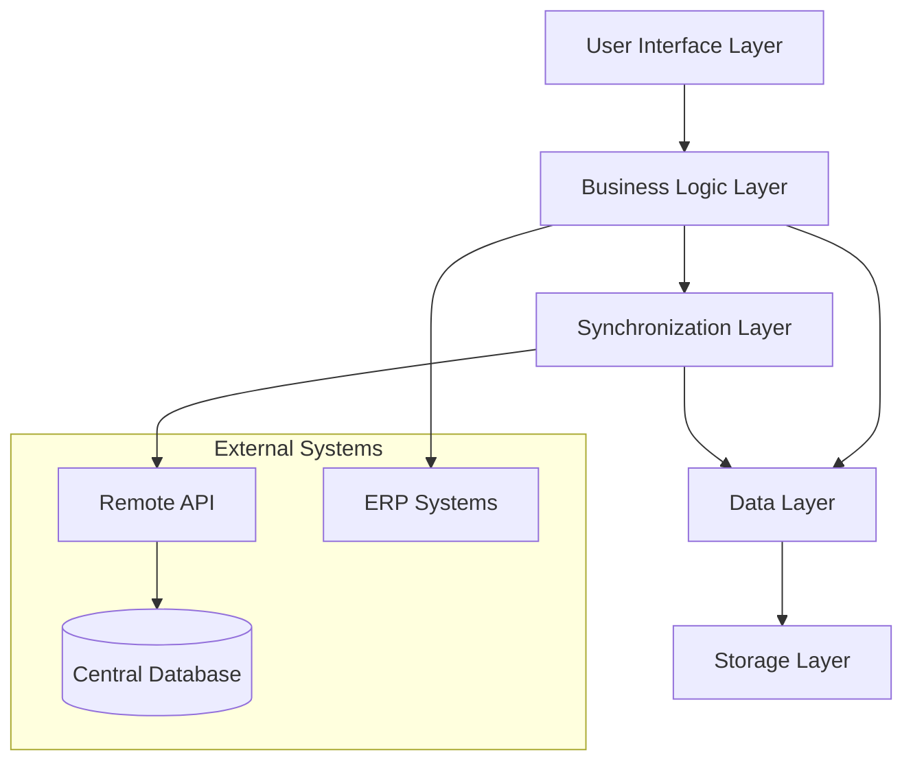

# Design Document: Offline-First Accounting System

## Overview

The Offline-First Accounting System is designed as a comprehensive enterprise-grade solution that prioritizes local-first data management with robust synchronization capabilities. The system architecture follows the CRDT (Conflict-free Replicated Data Types) pattern combined with accounting-specific conflict resolution strategies to ensure data integrity and consistency across distributed environments.

The system is built on a layered architecture that separates concerns between data persistence, business logic, synchronization, and user interface layers. This design enables the system to function seamlessly in offline, online, and intermittent connectivity scenarios while maintaining the strict data integrity requirements of financial systems.

## Architecture

### High-Level Architecture



### Component Architecture

The system consists of several key architectural components:

**1. Local-First Data Store**
- Dexie.js (IndexedDB wrapper) for browser-native storage
- Transaction API with atomic operations for data consistency
- Note: True ACID isolation not fully achievable in IndexedDB; compensated with application-level transaction management
- Maintains separate storage pools for different data types
- Storage quota monitoring critical for browser environments
- Compound indexes for query performance optimization
- Transaction batching for write efficiency

**2. Synchronization Engine**
- Event-sourced architecture for tracking all changes
- Implements vector clocks for conflict detection
- Uses operational transformation for concurrent edits
- Supports selective synchronization based on user permissions

**Conflict Detection Strategy**:
1. PRIMARY: Server-assigned sequence numbers (simpler, faster)
2. SECONDARY: Vector clocks for concurrent edit detection
3. FALLBACK: Last-write-wins with user notification

**3. Conflict Resolution System**
- Accounting-specific resolution strategies
- Maintains conflict history for audit purposes
- Implements escalation workflows for complex conflicts
- Supports manual resolution with guided workflows
- Semantic duplicate detection for payment conflicts (same supplier, ±5% amount, ±3 days)
- Never auto-resolves payment conflicts - requires human confirmation

**4. Security and Encryption Layer**
- AES-256-GCM encryption for data at rest
- TLS 1.3 for data in transit
- Key derivation using PBKDF2 with salt (100,000 iterations minimum)
- Field-level encryption for sensitive data
- Auto-lock after 5 minutes of inactivity
- Secure wipe on logout with data overwrite

## Components and Interfaces

### Core Components

#### 1. OfflineDataManager

```typescript
interface OfflineDataManager {
  // Data operations
  createTransaction(transaction: Transaction): Promise<TransactionResult>
  updateTransaction(id: string, updates: Partial<Transaction>): Promise<TransactionResult>
  deleteTransaction(id: string): Promise<void>
  
  // Query operations
  getTransactions(filter: TransactionFilter): Promise<Transaction[]>
  getTransactionById(id: string): Promise<Transaction | null>
  
  // Sync operations
  queueForSync(operation: SyncOperation): Promise<void>
  getPendingOperations(): Promise<SyncOperation[]>
  
  // Storage management
  getStorageUsage(): Promise<StorageInfo>
  optimizeStorage(): Promise<void>
}
```

#### 2. SynchronizationEngine

```typescript
interface SynchronizationEngine {
  // Sync control
  startSync(): Promise<SyncResult>
  stopSync(): void
  pauseSync(): void
  resumeSync(): void
  
  // Conflict resolution
  resolveConflict(conflict: DataConflict): Promise<ConflictResolution>
  getConflicts(): Promise<DataConflict[]>
  
  // Status monitoring
  getSyncStatus(): SyncStatus
  onSyncStatusChange(callback: (status: SyncStatus) => void): void
  
  // Configuration
  setSyncStrategy(strategy: SyncStrategy): void
  setConflictResolutionRules(rules: ConflictResolutionRule[]): void
}
```

#### 3. SecurityManager

```typescript
interface SecurityManager {
  // Authentication
  authenticate(credentials: UserCredentials): Promise<AuthResult>
  refreshSession(): Promise<AuthResult>
  logout(): Promise<void>
  
  // Encryption
  encryptData(data: any, classification: DataClassification): Promise<EncryptedData>
  decryptData(encryptedData: EncryptedData): Promise<any>
  
  // Access control
  checkPermission(resource: string, action: string): Promise<boolean>
  getPermissions(): Promise<Permission[]>
  
  // Security monitoring
  logSecurityEvent(event: SecurityEvent): Promise<void>
  getSecurityLogs(): Promise<SecurityEvent[]>
}
```

#### 4. ConflictResolver

```typescript
interface ConflictResolver {
  // Conflict detection
  detectConflicts(localChanges: Change[], remoteChanges: Change[]): Promise<DataConflict[]>
  
  // Resolution strategies
  resolveAutomatically(conflict: DataConflict): Promise<ConflictResolution | null>
  resolveManually(conflict: DataConflict, resolution: ManualResolution): Promise<ConflictResolution>
  
  // Accounting-specific resolution
  resolveSequenceConflict(conflict: SequenceConflict): Promise<ConflictResolution>
  resolveAmountConflict(conflict: AmountConflict): Promise<ConflictResolution>
  resolveFiscalPeriodConflict(conflict: FiscalPeriodConflict): Promise<ConflictResolution>
}

// Enhanced accounting-specific conflict resolver with semantic duplicate detection
interface AccountingConflictResolver extends ConflictResolver {
  // CRITICAL: Detect semantic duplicates, not just version conflicts
  detectSemanticDuplicates(operation: SyncOperation): Promise<SemanticDuplicate[]>
  
  // Check: same supplier, same amount, same date range = likely duplicate
  isSuspectedDuplicate(op1: SyncOperation, op2: SyncOperation): boolean
  
  // MANDATORY: Flag for human review, never auto-resolve payments
  flagForReconciliation(duplicate: SemanticDuplicate): Promise<void>
}

interface SemanticDuplicate {
  operation1: SyncOperation
  operation2: SyncOperation
  matchScore: number  // 0-100, based on similarity
  matchReasons: string[]  // e.g., ["same supplier", "amount within 5%"]
  requiresManualReview: boolean
}
```

### Interface Specifications

#### Data Synchronization Interface

```typescript
interface SyncOperation {
  id: string
  type: 'CREATE' | 'UPDATE' | 'DELETE'
  entityType: string
  entityId: string
  data: any
  timestamp: Date
  userId: string
  deviceId: string
  vectorClock: VectorClock
  dependencies: string[]
}

interface SyncResult {
  success: boolean
  syncedOperations: number
  conflicts: DataConflict[]
  errors: SyncError[]
  duration: number
}
```

#### Conflict Resolution Interface

```typescript
interface DataConflict {
  id: string
  type: ConflictType
  localOperation: SyncOperation
  remoteOperation: SyncOperation
  conflictData: ConflictData
  severity: ConflictSeverity
  autoResolvable: boolean
}

interface ConflictResolution {
  conflictId: string
  strategy: ResolutionStrategy
  resolvedData: any
  auditTrail: AuditEntry[]
  timestamp: Date
}
```

## Data Models

### Core Financial Entities

#### Transaction Model

```typescript
// Enhanced sync status with server-side verification gate
type TransactionSyncStatus = 
  | 'local_draft'           // Created offline, not yet validated
  | 'pending_verification'  // Synced to server, awaiting accounting validation
  | 'verified'              // Passed double-entry and business rule checks
  | 'posted'                // Committed to ledger — immutable
  | 'conflict'              // Sync conflict requiring manual resolution
  | 'rejected'              // Failed server-side validation

interface Transaction {
  id: string
  referenceNumber: string
  date: Date
  description: string
  totalAmount: Decimal
  status: TransactionStatus
  fiscalPeriodId: string
  createdBy: string
  createdAt: Date
  modifiedBy: string
  modifiedAt: Date
  
  // Offline-specific fields
  localId?: string
  syncStatus: TransactionSyncStatus
  vectorClock: VectorClock
  conflictVersion?: number
  verificationErrors?: string[]  // Populated if status = 'rejected'
  verifiedAt?: Date              // Timestamp when verified
  verifiedBy?: string            // User/system that verified
  
  // Relationships
  lines: TransactionLine[]
  attachments: Attachment[]
  approvals: Approval[]
  auditTrail: AuditEntry[]
}
```

#### Transaction Line Model

```typescript
interface TransactionLine {
  id: string
  transactionId: string
  accountId: string
  description: string
  debitAmount: Decimal
  creditAmount: Decimal
  dimensions: Dimension[]
  
  // Offline-specific fields
  localId?: string
  syncStatus: SyncStatus
  vectorClock: VectorClock
}
```

#### Conflict Data Model

```typescript
interface ConflictData {
  conflictType: ConflictType
  fieldConflicts: FieldConflict[]
  dependencyConflicts: DependencyConflict[]
  businessRuleViolations: BusinessRuleViolation[]
}

interface FieldConflict {
  fieldName: string
  localValue: any
  remoteValue: any
  dataType: string
  conflictReason: string
}
```

### Offline-Specific Models

#### Sync Queue Model

```typescript
interface SyncQueueEntry {
  id: string
  operation: SyncOperation
  priority: number
  retryCount: number
  maxRetries: number
  nextRetryAt: Date
  status: QueueStatus
  error?: string
}
```

#### Storage Management Model

```typescript
interface StorageInfo {
  totalCapacity: number
  usedSpace: number
  availableSpace: number
  dataBreakdown: {
    transactions: number
    attachments: number
    cache: number
    indexes: number
  }
  recommendations: StorageRecommendation[]
  attachmentMode: 'thumbnail-only' | 'full' | 'cloud-reference'
  mobileStorageCap: number  // 200MB hard cap for mobile browsers
  quotaUsagePercent: number
  projectedDaysUntilFull: number
}

// Real-world storage estimates for 30-day offline operation
interface StorageEstimates {
  transactions: { volume: number, sizePerItem: number, total: number }  // 200/day, 5KB ea, 30MB
  transactionLines: { volume: number, sizePerItem: number, total: number }  // 600/day, 1KB ea, 18MB
  attachmentRefs: { volume: number, sizePerItem: number, total: number }  // 50/day, 2KB ea, 3MB
  reportsCache: { volume: number, sizePerItem: number, total: number }  // 10/day, 200KB, 60MB
  totalEstimate: number  // ~111MB for 30 days
}
```

### Security Models

#### Encryption Model

```typescript
interface EncryptedData {
  encryptedContent: string
  encryptionAlgorithm: string
  keyId: string
  iv: string
  authTag: string
  classification: DataClassification
}

interface SecurityEvent {
  id: string
  type: SecurityEventType
  severity: SecuritySeverity
  timestamp: Date
  userId: string
  deviceId: string
  details: any
  resolved: boolean
}
```

## Correctness Properties

*A property is a characteristic or behavior that should hold true across all valid executions of a system—essentially, a formal statement about what the system should do. Properties serve as the bridge between human-readable specifications and machine-verifiable correctness guarantees.*

### Data Integrity Properties

Property 1: ACID Transaction Compliance
*For any* set of financial operations, either all operations succeed and maintain database consistency, or all operations fail and the database remains unchanged
**Validates: Requirements 1.1**

Property 2: Cryptographic Integrity Verification
*For any* transaction created offline, the system generates a valid cryptographic hash that can be verified for data integrity
**Validates: Requirements 1.2**

Property 3: Immutable Audit Trail
*For any* audit trail entry, once created it cannot be modified, and the blockchain-style linking between entries remains intact
**Validates: Requirements 1.3**

Property 4: Accounting Equation Balance
*For any* financial transaction, the accounting equation (Assets = Liabilities + Equity) remains balanced after the transaction is committed
**Validates: Requirements 1.5**

Property 5: Referential Integrity Preservation
*For any* set of related financial records, referential integrity constraints are maintained across all operations
**Validates: Requirements 1.7**

### Conflict Resolution Properties

Property 6: Automatic Sequence Rebasing
*For any* sequence conflict in transaction numbering, the system automatically rebases sequences while preserving chronological order
**Validates: Requirements 2.1**

Property 7: Comprehensive Conflict Preservation
*For any* data conflict, all conflicting versions are preserved in the audit trail with complete resolution history
**Validates: Requirements 2.6**

Property 8: Fiscal Period Conflict Protection
*For any* conflict involving closed fiscal periods, changes are rejected and period integrity is maintained
**Validates: Requirements 2.5**

Property 9: Intelligent Multi-Line Merging
*For any* multi-line entry with concurrent edits on different lines, changes are merged without data loss or corruption
**Validates: Requirements 3.4**

### Storage Management Properties

Property 10: Current Fiscal Year Prioritization
*For any* storage allocation decision, current fiscal year data is prioritized for offline availability over historical data
**Validates: Requirements 4.1**

Property 11: Intelligent Storage Archiving
*For any* storage limit approach, older periods are archived while maintaining data accessibility and integrity
**Validates: Requirements 4.2**

Property 12: Attachment Optimization
*For any* large attachment, intelligent caching and compression are applied without data loss
**Validates: Requirements 4.3**

Property 13: Storage Pool Separation
*For any* data type, storage is maintained in separate pools with appropriate allocation and management policies
**Validates: Requirements 4.5**

### Security Properties

Property 14: Comprehensive Data Encryption
*For any* offline data, AES-256-GCM encryption is applied with appropriate key management and classification
**Validates: Requirements 5.1, 5.5, 5.6**

Property 15: Session Security Management
*For any* user session, PIN authentication is required and automatic locks are enforced based on idle time and security policies
**Validates: Requirements 5.2, 5.3**

Property 16: Security Incident Response
*For any* security violation, incidents are logged with complete details and appropriate administrators are alerted
**Validates: Requirements 5.7**

### Performance Properties

Property 17: Operation Overhead Limits
*For any* standard accounting operation, the offline-first system adds less than 100ms of processing overhead
**Validates: Requirements 6.1**

Property 18: Queue Performance Scalability
*For any* offline queue with up to 1000+ operations, performance remains within acceptable limits without degradation
**Validates: Requirements 6.2**

Property 19: Background Sync Non-Blocking
*For any* synchronization operation, the user interface remains responsive and unblocked during processing
**Validates: Requirements 6.4**

### Collaboration Properties

Property 20: Offline Lock Management
*For any* offline edit session, appropriate locks are created and maintained for the configured timeout period
**Validates: Requirements 3.1, 3.6**

Property 21: Lock Conflict Detection
*For any* attempt to edit a locked record, appropriate warnings are displayed and conflicts are prevented
**Validates: Requirements 3.2**

Property 22: Proactive Conflict Detection
*For any* potential sync conflict, the system detects and flags conflicts before synchronization occurs
**Validates: Requirements 3.3**

### Serialization Properties

Property 23: Multi-Format Parsing Accuracy
*For any* valid CSV, Excel, or QIF file, the system parses data correctly according to format specifications
**Validates: Requirements 11.1**

Property 24: Export Format Validity
*For any* financial data export, generated files are valid and importable by other accounting systems
**Validates: Requirements 11.2**

Property 25: Serialization Round-Trip Consistency
*For any* valid financial data object, parsing then printing then parsing produces an equivalent object
**Validates: Requirements 11.4**

Property 26: JSON Schema Validation
*For any* offline storage operation, data is serialized to JSON format with valid schema validation
**Validates: Requirements 11.7**

### Synchronization Properties

Property 27: Automatic Sync Activation
*For any* network connectivity restoration, synchronization begins automatically without user intervention
**Validates: Requirements 12.1**

Property 28: Incremental Sync Optimization
*For any* large dataset synchronization, incremental sync is used to minimize bandwidth and processing requirements
**Validates: Requirements 12.3**

Property 29: Sync Failure Recovery
*For any* sync failure, the system implements exponential backoff retry with detailed error logging and recovery procedures
**Validates: Requirements 12.5, 12.6**

Property 30: Critical Conflict Escalation
*For any* critical data conflict, synchronization is halted and manual intervention is required before proceeding
**Validates: Requirements 12.7**

### Compliance Properties

Property 31: SOX Compliance Maintenance
*For any* financial operation, SOX-required internal controls and audit trails are maintained and verifiable
**Validates: Requirements 10.1**

Property 32: GDPR Data Handling
*For any* personal data operation, GDPR requirements for data portability and deletion are enforced
**Validates: Requirements 10.2**

Property 33: GAAP Transaction Compliance
*For any* accounting transaction and report, GAAP compliance rules are enforced and validated
**Validates: Requirements 10.4**

Property 34: Compliance Report Integrity
*For any* compliance report generation, tamper-evident digital signatures are applied and verifiable
**Validates: Requirements 10.5**

## Error Handling

### Error Classification

The system implements a comprehensive error handling strategy with multiple classification levels:

**1. Data Integrity Errors**
- Corruption detection and quarantine procedures
- Automatic data recovery from backup sources
- Escalation to data integrity specialists

**2. Synchronization Errors**
- Network connectivity failures with automatic retry
- Conflict resolution failures requiring manual intervention
- Data consistency violations during sync operations

**3. Security Errors**
- Authentication failures with lockout policies
- Encryption/decryption errors with key recovery
- Access control violations with audit logging

**4. Performance Errors**
- Memory exhaustion with automatic cleanup
- Storage quota exceeded with archiving recommendations
- Processing timeout with operation queuing

### Error Recovery Strategies

#### Automatic Recovery
```typescript
interface AutoRecoveryStrategy {
  detectError(operation: Operation): ErrorType | null
  canAutoRecover(error: ErrorType): boolean
  performRecovery(error: ErrorType): Promise<RecoveryResult>
  logRecoveryAttempt(error: ErrorType, result: RecoveryResult): void
}
```

#### Manual Intervention
```typescript
interface ManualInterventionStrategy {
  requiresManualIntervention(error: ErrorType): boolean
  createInterventionRequest(error: ErrorType): InterventionRequest
  notifyResponsibleParties(request: InterventionRequest): void
  trackResolutionProgress(request: InterventionRequest): ResolutionStatus
}
```

### Graceful Degradation

The system implements graceful degradation patterns:

1. **Network Degradation**: Automatic fallback to offline mode
2. **Storage Degradation**: Intelligent data archiving and cleanup
3. **Performance Degradation**: Operation queuing and background processing
4. **Security Degradation**: Enhanced authentication and monitoring

### Audit Trail Implementation

**Server-Side Hash Chain**:
- Client generates audit entry with operation details
- Server appends to immutable chain with hash of previous entry
- Server verifies chain integrity on each append
- Client CANNOT rewrite chain (prevents tampering)
- Hash algorithm: SHA-256
- Each entry contains: `previousHash`, `entryData`, `timestamp`, `userId`

**Blockchain-Style Linking**:
```typescript
interface AuditEntry {
  id: string
  previousHash: string  // SHA-256 hash of previous entry
  entryHash: string      // SHA-256 hash of this entry
  operation: string
  entityType: string
  entityId: string
  changes: any
  timestamp: Date
  userId: string
  deviceId: string
}

// Server-side verification on each append
function appendAuditEntry(entry: AuditEntry): boolean {
  const lastEntry = getLastAuditEntry()
  const computedHash = sha256(JSON.stringify(lastEntry))
  
  if (entry.previousHash !== computedHash) {
    throw new Error('Audit chain integrity violation')
  }
  
  entry.entryHash = sha256(JSON.stringify(entry))
  saveAuditEntry(entry)
  return true
}
```

### Service Worker Token Expiry Handling

**Background Sync with Authentication**:
```typescript
// Token expiry handling in background sync
async function attemptBackgroundSync() {
  const token = await getStoredToken()
  
  if (isTokenExpired(token)) {
    // Queue sync for next user interaction (when they can re-auth)
    await queueSyncForNextSession()
    await logToOfflineMetrics({
      reason: 'auth_expired',
      queuedOperations: pendingOps.length,
      nextSyncOpportunity: 'user_interaction'
    })
    return
  }
  
  // Proceed with sync...
  await performSync(token)
}

// Service Worker MUST NOT cache sensitive financial data
const CACHE_STRATEGY = {
  staticAssets: 'cache-first',
  appShell: 'cache-first',
  apiResponses: 'network-only',  // NEVER cache financial data
  metadata: 'stale-while-revalidate'
}
```

## Testing Strategy

### Dual Testing Approach

The system employs both unit testing and property-based testing for comprehensive coverage:

**Unit Testing Focus:**
- Specific examples of accounting scenarios
- Edge cases in financial calculations
- Integration points between system components
- Error conditions and exception handling
- User interface interactions and workflows

**Property-Based Testing Focus:**
- Universal properties across all financial data
- Comprehensive input coverage through randomization
- Conflict resolution scenarios with generated data
- Performance characteristics under various loads
- Security properties across different threat models

### Property-Based Testing Configuration

**Testing Framework**: fast-check (JavaScript/TypeScript)
**Minimum Iterations**: 100 per property test
**Test Tagging Format**: **Feature: offline-first-accounting-system, Property {number}: {property_text}**

Each property test must:
1. Reference its corresponding design document property
2. Generate realistic financial data scenarios
3. Validate universal correctness properties
4. Provide detailed failure information for debugging

### Testing Categories

#### 1. Data Integrity Testing
- ACID compliance verification
- Cryptographic integrity validation
- Audit trail immutability testing
- Referential integrity preservation

#### 2. Conflict Resolution Testing
- Sequence conflict scenarios
- Amount discrepancy handling
- Multi-user collaboration conflicts
- Fiscal period protection testing

#### 3. Performance Testing
- Operation overhead measurement
- Queue scalability validation
- Memory usage optimization
- Background processing efficiency

#### 4. Security Testing
- Encryption/decryption validation
- Authentication and authorization
- Security incident response
- Data classification handling

#### 5. Synchronization Testing
- Network failure scenarios
- Large dataset synchronization
- Conflict detection and resolution
- Recovery and rollback procedures

### Chaos Engineering Integration

The system supports chaos engineering practices:

1. **Network Chaos**: Simulated connectivity failures and latency
2. **Data Chaos**: Controlled corruption and integrity violations
3. **Performance Chaos**: Resource exhaustion and bottleneck simulation
4. **Security Chaos**: Simulated attacks and breach scenarios

### Test Data Management

**Realistic Data Generation:**
- Construction company financial scenarios
- Multi-year fiscal period data
- Complex multi-line transaction entries
- Various attachment types and sizes
- Regulatory compliance test cases

**Test Environment Isolation:**
- Separate test databases for each scenario
- Isolated encryption keys and security contexts
- Independent synchronization endpoints
- Controlled network simulation environments

This comprehensive testing strategy ensures the offline-first accounting system meets enterprise-grade reliability and security requirements while maintaining the specific needs of construction company financial management.