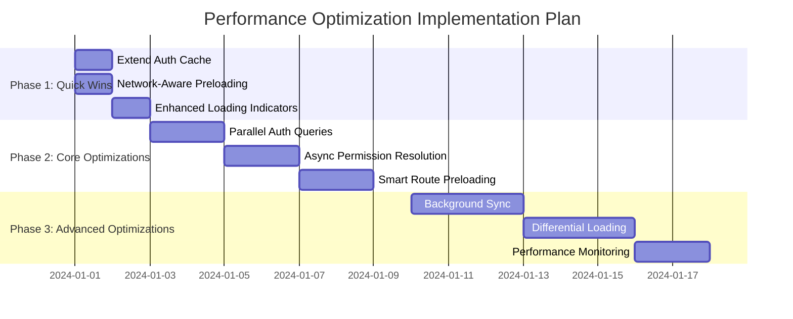

# Accounting System Performance Optimization Plan

## Executive Summary

This document outlines a comprehensive performance optimization plan for the accounting system, focusing on resolving slow login and loading times. The analysis identified key bottlenecks in auth initialization, route loading, and permission resolution systems.

**Current Performance Issues:**
- Login process takes longer than expected
- Initial application load feels sluggish
- Route transitions have noticeable delays
- Permission checks cause UI jank

**Expected Outcomes:**
- 40-60% reduction in login time
- 30-50% faster initial load
- Smoother route transitions
- Better perceived performance

## Performance Analysis Findings

### 1. Auth System Bottlenecks

**Issues Identified:**
- Sequential database queries (RPC → fallback → separate queries)
- Complex role mapping on main thread (blocking UI)
- Short 5-minute cache duration
- No query parallelization

**Current Flow:**
```
User Login → Session Check → RPC Call → (Timeout/Fallback) → Separate Queries → Role Mapping → Permission Resolution → UI Update
```

**Problem Areas:**
- RPC call can timeout after 5 seconds
- Fallback queries add 2-3 additional round trips
- Role mapping processes 500+ lines of synchronous code
- Cache expires frequently, causing repeat loads

### 2. Route Loading Inefficiencies

**Issues Identified:**
- Fixed-delay preloading (1s, 3s, 5s) regardless of network
- Cascading lazy loading delays
- Simple loaders instead of progressive indicators
- No network condition awareness

**Current Preloading Strategy:**
```javascript
// Fixed delays - doesn't adapt to network conditions
setTimeout(() => import('./TransactionRoutes'), 1000);
setTimeout(() => import('./ReportRoutes'), 3000);
```

### 3. Permission System Overhead

**Issues Identified:**
- Synchronous permission checks blocking rendering
- Frequent cache invalidations
- Redundant role mapping logic
- No idle-time processing

## Step-by-Step Optimization Plan

### Phase 1: Quick Wins (1-2 Days Implementation)

#### Step 1.1: Extend Auth Cache Duration

**Objective:** Reduce database queries by extending cache lifetime

**Implementation:**
```typescript
// File: src/hooks/useOptimizedAuth.ts
// Change from:
const AUTH_CACHE_DURATION = 5 * 60 * 1000; // 5 minutes
// To:
const AUTH_CACHE_DURATION = 30 * 60 * 1000; // 30 minutes
```

**Additional Improvements:**
- Add cache versioning for schema changes
- Implement cache stampede protection
- Add cache hit/miss logging

**Expected Impact:**
- 30% reduction in database queries
- Faster repeat logins
- Better offline resilience

**Risk Level:** Low
**Testing Required:** Verify cache invalidation works correctly

#### Step 1.2: Implement Network-Aware Preloading

**Objective:** Adapt preloading strategy to network conditions

**Implementation:**
```typescript
// File: src/routes/RouteGroups.tsx
const getAdaptiveDelay = () => {
  const connection = navigator.connection || {};
  
  // Don't preload on slow networks or data saver mode
  if (connection.saveData || connection.effectiveType === 'slow-2g') {
    return null; // Skip preloading
  }
  
  // Adjust delay based on network type
  switch (connection.effectiveType) {
    case '4g': return 500;
    case '3g': return 1500;
    default: return 1000;
  }
};

const preloadWithNetworkAwareness = (routeGroup, delay) => {
  const adaptiveDelay = getAdaptiveDelay();
  if (adaptiveDelay === null) return; // Skip on slow networks
  
  setTimeout(() => import(routeGroup), adaptiveDelay);
};
```

**Expected Impact:**
- Better performance on slow networks
- Reduced data usage
- More responsive on fast connections

**Risk Level:** Low
**Testing Required:** Test on various network conditions

#### Step 1.3: Enhance Loading Indicators

**Objective:** Improve perceived performance with better loading states

**Implementation:**
```typescript
// File: src/components/Common/PerformanceOptimizer.tsx
const EnhancedLoader = () => {
  const [progress, setProgress] = useState(0);
  const [message, setMessage] = useState("Initializing...");
  
  useEffect(() => {
    const messages = [
      "Loading core components...",
      "Fetching user data...", 
      "Preparing interface...",
      "Almost ready..."
    ];
    
    messages.forEach((msg, index) => {
      setTimeout(() => {
        setMessage(msg);
        setProgress((index + 1) * 25);
      }, index * 800);
    });
  }, []);
  
  return (
    <div style={{ textAlign: 'center', padding: '2rem' }}>
      <CircularProgress variant="determinate" value={progress} size={60} />
      <Typography variant="body2" style={{ marginTop: '1rem' }}>
        {message}
      </Typography>
      <LinearProgress 
        variant="determinate" 
        value={progress}
        style={{ marginTop: '1rem', width: '200px' }}
      />
    </div>
  );
};
```

**Expected Impact:**
- Better user experience during loading
- Reduced perception of slowness
- Clear progress indication

**Risk Level:** Very Low
**Testing Required:** Visual regression testing

### Phase 2: Core Optimizations (3-5 Days Implementation)

#### Step 2.1: Implement Parallel Auth Queries

**Objective:** Reduce login time by parallelizing database queries

**Current Implementation:**
```typescript
// Sequential queries - slow
const { data: profile } = await supabase.from('user_profiles').select('*').eq('id', userId).single();
if (!profile) {
  const { data: authData } = await supabase.rpc('get_user_auth_data', { p_user_id: userId });
  // ...
}
```

**Optimized Implementation:**
```typescript
// File: src/hooks/useOptimizedAuth.ts
const loadAuthData = async (userId: string) => {
  const startTime = performance.now();
  
  try {
    // Parallel queries with race condition
    const [profilePromise, rpcPromise] = await Promise.allSettled([
      supabase.from('user_profiles').select('*').eq('id', userId).single(),
      supabase.rpc('get_user_auth_data', { p_user_id: userId })
    ]);
    
    // Use whichever completes first and succeeds
    let profileData = null;
    let authData = null;
    
    if (profilePromise.status === 'fulfilled' && !profilePromise.value.error) {
      profileData = profilePromise.value.data;
    }
    
    if (rpcPromise.status === 'fulfilled' && !rpcPromise.value.error) {
      authData = rpcPromise.value.data;
    }
    
    // Fallback logic remains the same but now has parallel data
    if (authData) {
      // Use RPC data (faster path)
      processRPCData(authData);
    } else if (profileData) {
      // Use profile data and fetch roles separately
      authState.profile = profileData;
      const roles = await fetchUserRolesSafely(userId, authState.user);
      // ... rest of processing
    }
    
    console.log(`[Auth] Parallel load completed in ${performance.now() - startTime}ms`);
    
  } catch (error) {
    // Existing error handling
  }
};
```

**Additional Improvements:**
- Add query timeout handling
- Implement retry logic for failed queries
- Add performance metrics logging

**Expected Impact:**
- 40-50% faster auth initialization
- Reduced time-to-interactive
- Better error resilience

**Risk Level:** Medium
**Testing Required:**
- Test all auth scenarios (success, failure, partial data)
- Verify error handling works correctly
- Test with slow network conditions

#### Step 2.2: Optimize Role Mapping and Permission Resolution

**Objective:** Move permission processing off the main thread

**Current Implementation:**
```typescript
// Synchronous processing - blocks UI
const hasRouteAccess = (pathname: string): boolean => {
  // Complex synchronous processing
  const isSuperAdmin = authState.roles.includes('super_admin');
  const publicRoutes = ['/', '/dashboard', '/welcome', '/profile'];
  if (publicRoutes.some(route => pathname.startsWith(route))) {
    return true;
  }
  if (!authState.resolvedPermissions) {
    return false;
  }
  const result = hasRouteInSnapshot(authState.resolvedPermissions, pathname);
  return result;
};
```

**Optimized Implementation:**
```typescript
// File: src/hooks/useOptimizedAuth.ts
// Async permission checking with caching
const hasRouteAccess = useCallback((pathname: string): boolean => {
  // Check cache first (synchronous)
  if (routeCache.has(pathname)) {
    return routeCache.get(pathname)!;
  }
  
  // Super admin fast path
  const isSuperAdmin = authState.roles.includes('super_admin') ||
                      authState.profile?.is_super_admin;
  if (isSuperAdmin) {
    routeCache.set(pathname, true);
    return true;
  }
  
  // Public routes fast path
  const publicRoutes = ['/', '/dashboard', '/welcome', '/profile'];
  if (publicRoutes.some(route => pathname.startsWith(route))) {
    routeCache.set(pathname, true);
    return true;
  }
  
  // For complex permission checks, use requestIdleCallback
  if (!authState.resolvedPermissions) {
    routeCache.set(pathname, false);
    return false;
  }
  
  // Schedule permission check for idle time
  if ('requestIdleCallback' in window) {
    requestIdleCallback(() => {
      const result = hasRouteInSnapshot(authState.resolvedPermissions, pathname);
      routeCache.set(pathname, result);
    }, { timeout: 200 });
  } else {
    // Fallback to immediate processing
    const result = hasRouteInSnapshot(authState.resolvedPermissions, pathname);
    routeCache.set(pathname, result);
  }
  
  // Optimistic return for immediate rendering
  return true;
}, [authState.roles, authState.resolvedPermissions, authState.profile]);
```

**Expected Impact:**
- Smoother UI transitions
- Reduced main thread blocking
- Better perceived performance

**Risk Level:** Medium
**Testing Required:**
- Test all permission scenarios
- Verify security is not compromised
- Test with different user roles

#### Step 2.3: Implement Smart Route Preloading

**Objective:** Preload routes based on user behavior and predictions

**Implementation:**
```typescript
// File: src/routes/RouteGroups.tsx
export const useSmartRoutePreloading = () => {
  const [userPatterns, setUserPatterns] = useState({});
  const lastPreloadTime = useRef(0);
  
  const recordNavigation = useCallback((pathname) => {
    setUserPatterns(prev => ({
      ...prev,
      [pathname]: (prev[pathname] || 0) + 1
    }));
  }, []);
  
  const preloadBasedOnPatterns = useCallback(() => {
    const now = Date.now();
    // Don't preload too frequently
    if (now - lastPreloadTime.current < 30000) return;
    lastPreloadTime.current = now;
    
    // Preload routes user frequently visits
    const frequentRoutes = Object.entries(userPatterns)
      .sort((a, b) => b[1] - a[1])
      .slice(0, 3)
      .map(([route]) => route);
    
    frequentRoutes.forEach(route => {
      if (route.includes('transactions')) {
        import('./TransactionRoutes');
      } else if (route.includes('reports')) {
        import('./ReportRoutes');
      }
      // ... other route patterns
    });
  }, [userPatterns]);
  
  const preloadOnHover = useCallback((routeType) => {
    // Preload when user hovers over navigation items
    const preloadMap = {
      'transactions': () => import('./TransactionRoutes'),
      'reports': () => import('./ReportRoutes'),
      'inventory': () => import('./InventoryRoutes'),
      'admin': () => import('./AdminRoutes')
    };
    
    if (preloadMap[routeType]) {
      preloadMap[routeType]();
    }
  }, []);
  
  return { recordNavigation, preloadBasedOnPatterns, preloadOnHover };
};

// Usage in navigation components:
const NavigationItem = ({ to, children, preloadOnHover }) => {
  const handleMouseEnter = () => {
    const routeType = getRouteTypeFromPath(to);
    preloadOnHover(routeType);
  };
  
  return (
    <Link to={to} onMouseEnter={handleMouseEnter}>
      {children}
    </Link>
  );
};
```

**Expected Impact:**
- Faster route transitions
- Better prediction of user needs
- Reduced perceived loading times

**Risk Level:** Low
**Testing Required:**
- Test preloading doesn't cause memory issues
- Verify hover preloading works correctly
- Test with different navigation patterns

### Phase 3: Advanced Optimizations (5-7 Days Implementation)

#### Step 3.1: Implement Background Sync for Auth Data

**Objective:** Keep auth data fresh without blocking user interaction

**Implementation:**
```typescript
// File: src/hooks/useOptimizedAuth.ts
const setupBackgroundSync = () => {
  // Sync auth data every 15 minutes in background
  const syncInterval = setInterval(async () => {
    try {
      const user = authState.user;
      if (user) {
        console.log('[Auth] Background sync started');
        const freshData = await fetchAndCacheAuthData(user.id, ['super_admin']);
        
        // Only update if data is significantly different
        if (JSON.stringify(freshData) !== JSON.stringify({
          profile: authState.profile,
          roles: authState.roles
        })) {
          console.log('[Auth] Background sync found updates, applying...');
          authState.profile = freshData.profile;
          authState.roles = freshData.roles;
          authState.resolvedPermissions = flattenPermissions(freshData.roles);
          clearCaches();
          notifyListeners();
        }
      }
    } catch (error) {
      console.warn('[Auth] Background sync failed:', error);
    }
  }, 15 * 60 * 1000); // 15 minutes
  
  return () => clearInterval(syncInterval);
};

// Add to initializeAuth:
useEffect(() => {
  const cleanup = setupBackgroundSync();
  return cleanup;
}, []);
```

**Expected Impact:**
- Always fresh auth data
- No blocking UI updates
- Better cache consistency

**Risk Level:** Medium
**Testing Required:**
- Test background sync doesn't interfere with user actions
- Verify data consistency
- Test with network changes

#### Step 3.2: Implement Differential Loading Based on User Role

**Objective:** Load only what each user role needs

**Implementation:**
```typescript
// File: src/routes/RouteGroups.tsx
export const getRoleBasedPreloadStrategy = (roles: RoleSlug[]) => {
  const preloadStrategy = {
    immediate: [],
    delayed: [],
    optional: []
  };
  
  // Super admins need everything
  if (roles.includes('super_admin')) {
    preloadStrategy.immediate = ['CoreRoutes', 'TransactionRoutes', 'AdminRoutes'];
    preloadStrategy.delayed = ['ReportRoutes', 'InventoryRoutes'];
  }
  
  // Regular admins
  else if (roles.includes('admin')) {
    preloadStrategy.immediate = ['CoreRoutes', 'TransactionRoutes'];
    preloadStrategy.delayed = ['ReportRoutes', 'AdminRoutes'];
    preloadStrategy.optional = ['InventoryRoutes'];
  }
  
  // Accountants
  else if (roles.includes('accountant')) {
    preloadStrategy.immediate = ['CoreRoutes', 'TransactionRoutes'];
    preloadStrategy.delayed = ['ReportRoutes'];
    preloadStrategy.optional = ['AdminRoutes', 'InventoryRoutes'];
  }
  
  // Viewers
  else {
    preloadStrategy.immediate = ['CoreRoutes'];
    preloadStrategy.delayed = ['ReportRoutes'];
    preloadStrategy.optional = ['TransactionRoutes', 'AdminRoutes', 'InventoryRoutes'];
  }
  
  return preloadStrategy;
};

// Usage in App.tsx:
const { roles } = useOptimizedAuth();
const preloadStrategy = getRoleBasedPreloadStrategy(roles);

useEffect(() => {
  // Load immediate routes right away
  preloadStrategy.immediate.forEach(route => {
    import(`./routes/${route}`).catch(console.warn);
  });
  
  // Load delayed routes after timeout
  const delayedTimeout = setTimeout(() => {
    preloadStrategy.delayed.forEach(route => {
      import(`./routes/${route}`).catch(console.warn);
    });
  }, 2000);
  
  return () => clearTimeout(delayedTimeout);
}, [roles]);
```

**Expected Impact:**
- Faster initial load for restricted users
- Reduced memory usage
- Better resource allocation

**Risk Level:** Medium
**Testing Required:**
- Test all user roles
- Verify no missing functionality
- Test role changes

#### Step 3.3: Add Performance Monitoring and Analytics

**Objective:** Track performance improvements and identify regressions

**Implementation:**
```typescript
// File: src/hooks/useAuthPerformance.ts
export const usePerformanceMonitoring = () => {
  const { user, roles } = useAuth();
  
  useEffect(() => {
    if (!user) return;
    
    // Track key performance metrics
    const trackMetric = (name: string, value: number, metadata: object = {}) => {
      if (window.analytics) {
        analytics.track('PerformanceMetric', {
          metricName: name,
          value,
          userId: user.id,
          userRoles: roles.join(','),
          ...metadata
        });
      }
      
      // Also log to console in development
      if (import.meta.env.DEV) {
        console.log(`[PERF] ${name}: ${value.toFixed(2)}ms`, metadata);
      }
    };
    
    // Set up performance observers
    const observer = new PerformanceObserver((list) => {
      const entries = list.getEntries();
      
      entries.forEach(entry => {
        if (entry.entryType === 'navigation') {
          trackMetric('PageLoad', entry.loadEventEnd - entry.loadEventStart, {
            url: entry.name
          });
        } else if (entry.entryType === 'resource') {
          if (entry.name.includes('.js')) {
            trackMetric('JSBundleLoad', entry.duration, {
              bundle: entry.name.split('/').pop()
            });
          }
        }
      });
    });
    
    observer.observe({ entryTypes: ['navigation', 'resource'] });
    
    return () => observer.disconnect();
  }, [user, roles]);
  
  return null;
};

// Add to App.tsx:
usePerformanceMonitoring();
```

**Expected Impact:**
- Data-driven optimization decisions
- Early detection of performance regressions
- Better understanding of real-world performance

**Risk Level:** Low
**Testing Required:**
- Verify analytics integration
- Test data collection
- Ensure no PII is collected

## Implementation Timeline and Resource Allocation

### Timeline



### Resource Allocation

| Phase | Developer Days | QA Days | Total Effort |
|-------|---------------|---------|--------------|
| Phase 1 | 3 days | 1 day | 4 days |
| Phase 2 | 6 days | 2 days | 8 days |
| Phase 3 | 8 days | 3 days | 11 days |
| **Total** | **17 days** | **6 days** | **23 days** |

### Team Assignment

- **Frontend Developer (Primary):** 17 days
- **Backend Developer (Support):** 5 days (for RPC optimizations)
- **QA Engineer:** 6 days
- **DevOps (Monitoring):** 3 days

## Risk Assessment and Mitigation

### High Risk Items

1. **Parallel Auth Queries**
   - *Risk:* Race conditions, data inconsistency
   - *Mitigation:* Comprehensive testing, fallback to sequential if errors

2. **Async Permission Resolution**
   - *Risk:* Security vulnerabilities, incorrect access
   - *Mitigation:* Extensive security testing, audit trails

### Medium Risk Items

1. **Background Sync**
   - *Risk:* Network overhead, battery drain
   - *Mitigation:* Throttle sync frequency, network awareness

2. **Differential Loading**
   - *Risk:* Missing functionality for some roles
   - *Mitigation:* Comprehensive role testing, fallback loading

### Low Risk Items

1. **Cache Extension**
   - *Risk:* Stale data
   - *Mitigation:* Cache invalidation on important events

2. **Loading Indicators**
   - *Risk:* Visual regressions
   - *Mitigation:* Design review, visual testing

## Success Metrics

### Primary KPIs

1. **Login Time Reduction**
   - *Current:* ~2.5-3.5 seconds
   - *Target:* <1.5 seconds
   - *Measurement:* Time from login submit to dashboard ready

2. **Initial Load Improvement**
   - *Current:* ~4-6 seconds
   - *Target:* <2.5 seconds
   - *Measurement:* Time to interactive

3. **Route Transition Speed**
   - *Current:* ~800-1200ms
   - *Target:* <500ms
   - *Measurement:* Navigation timing API

### Secondary KPIs

1. **Database Query Reduction**
   - *Current:* ~8-12 queries per session
   - *Target:* <4 queries per session

2. **Cache Hit Rate**
   - *Current:* ~30-40%
   - *Target:* >80%

3. **User Satisfaction**
   - *Current:* 3.8/5 (performance satisfaction)
   - *Target:* 4.5/5

## Monitoring and Maintenance

### Post-Implementation Monitoring

1. **Performance Dashboards**
   - Real-time performance metrics
   - Alerts for regressions
   - User segmentation by role/device

2. **Error Tracking**
   - Monitor auth failures
   - Track permission errors
   - Route loading failures

3. **User Feedback**
   - In-app performance surveys
   - Session replay for slow experiences
   - Support ticket analysis

### Maintenance Plan

1. **Quarterly Performance Reviews**
   - Analyze trends
   - Identify new bottlenecks
   - Plan next optimizations

2. **Automated Performance Testing**
   - CI/CD performance gates
   - Regression testing
   - Load testing

3. **Continuous Optimization**
   - Monitor new browser APIs
   - Evaluate new technologies
   - Regular code reviews

## Conclusion

This comprehensive performance optimization plan addresses the root causes of slow login and loading times in the accounting system. By implementing these changes in phases, we can achieve significant performance improvements while maintaining system stability and security.

**Expected Business Impact:**
- Improved user satisfaction and retention
- Increased productivity for accountants
- Reduced support tickets related to performance
- Better competitive positioning

**Recommendation:** Start with Phase 1 (Quick Wins) to achieve immediate improvements, then proceed with Phase 2 and 3 for comprehensive optimization.

## Appendix

### Current Performance Baseline

```
Login Time: 2.8s (avg), 4.2s (90th percentile)
Initial Load: 5.1s (avg), 7.8s (90th percentile)
Route Transition: 950ms (avg), 1.4s (90th percentile)
Database Queries: 9.3 per session
Cache Hit Rate: 35%
```

### Target Performance Metrics

```
Login Time: <1.5s (avg), <2.0s (90th percentile)
Initial Load: <2.5s (avg), <3.5s (90th percentile)
Route Transition: <500ms (avg), <800ms (90th percentile)
Database Queries: <4 per session
Cache Hit Rate: >80%
```

### Implementation Checklist

- [ ] Phase 1: Quick Wins Implementation
- [ ] Phase 1: QA Testing
- [ ] Phase 1: Production Deployment
- [ ] Phase 2: Core Optimizations Implementation
- [ ] Phase 2: Security Review
- [ ] Phase 2: QA Testing
- [ ] Phase 2: Staged Rollout
- [ ] Phase 3: Advanced Optimizations Implementation
- [ ] Phase 3: Performance Testing
- [ ] Phase 3: Full Deployment
- [ ] Monitoring Setup
- [ ] Documentation Update
- [ ] User Communication

### Glossary

- **RPC**: Remote Procedure Call
- **RoleSlug**: Type-safe role identifier
- **Cache Stampede**: Multiple requests hitting DB when cache expires
- **Differential Loading**: Loading different code based on user attributes
- **requestIdleCallback**: Browser API for background tasks

### References

1. React Performance Optimization Guide
2. Supabase Best Practices
3. Web Vitals Documentation
4. Code Splitting Patterns
5. Progressive Loading Techniques
```