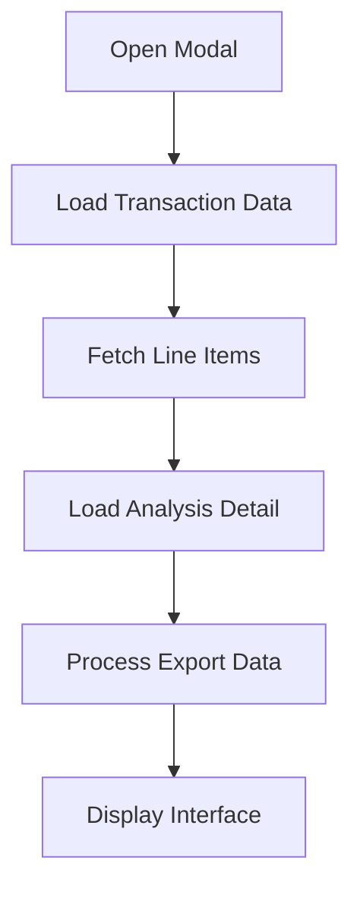
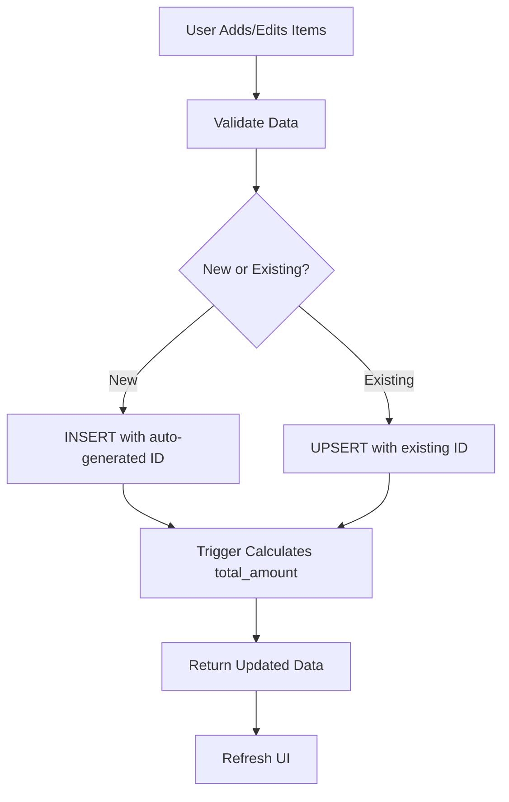
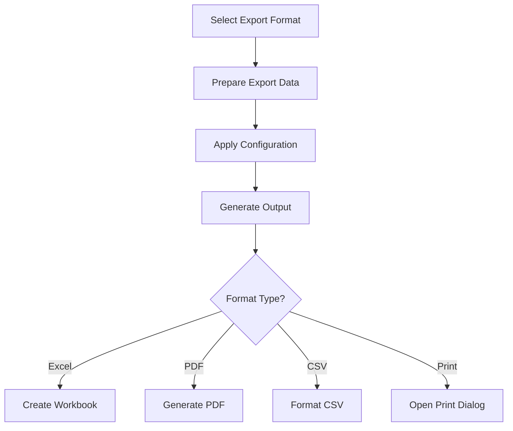

# 📊 Transactions and Line Items Services Documentation

## 🎯 Overview

This document provides comprehensive documentation for the **Transactions** and **Cost Analysis Line Items** services in the accounting system. These services handle financial transaction management and detailed cost breakdown analysis with professional export capabilities.

---

## 📁 Service Architecture

### **Core Services**
- **Transactions Service** (`src/services/transactions.ts`)
- **Cost Analysis Service** (`src/services/cost-analysis.ts`)
- **Universal Export Manager** (`src/utils/UniversalExportManager.ts`)

### **UI Components**
- **TransactionAnalysisModal** (`src/components/Transactions/TransactionAnalysisModal.tsx`)
- **ExportButtons** (`src/components/Common/ExportButtons.tsx`)

---

## 🗃️ Database Schema

### **transactions** Table
```sql
-- Core transaction records
CREATE TABLE transactions (
    id UUID PRIMARY KEY DEFAULT gen_random_uuid(),
    entry_number VARCHAR(50),
    description TEXT,
    amount NUMERIC,
    transaction_date DATE,
    org_id UUID,
    project_id UUID,
    is_posted BOOLEAN DEFAULT FALSE,
    created_at TIMESTAMP WITH TIME ZONE DEFAULT CURRENT_TIMESTAMP,
    updated_at TIMESTAMP WITH TIME ZONE DEFAULT CURRENT_TIMESTAMP
);
```

### **transaction_line_items** Table
```sql
-- Detailed cost breakdown for transactions
CREATE TABLE transaction_line_items (
    id UUID PRIMARY KEY DEFAULT gen_random_uuid(),
    transaction_id UUID NOT NULL REFERENCES transactions(id),
    line_number INTEGER NOT NULL DEFAULT 1,
    item_code VARCHAR(50),
    item_name VARCHAR(255),
    item_name_ar VARCHAR(255),
    description TEXT,
    description_ar TEXT,
    quantity NUMERIC NOT NULL DEFAULT 1.0,
    percentage NUMERIC NOT NULL DEFAULT 100.00,
    unit_price NUMERIC NOT NULL DEFAULT 0.0,
    unit_of_measure VARCHAR(50) DEFAULT 'piece',
    total_amount NUMERIC, -- Calculated by trigger
    analysis_work_item_id UUID,
    sub_tree_id UUID, -- References expenses categories
    org_id UUID NOT NULL,
    created_at TIMESTAMP WITH TIME ZONE DEFAULT CURRENT_TIMESTAMP,
    updated_at TIMESTAMP WITH TIME ZONE DEFAULT CURRENT_TIMESTAMP
);
```

### **Automatic Calculation Trigger**
```sql
-- Trigger function for total_amount calculation
CREATE OR REPLACE FUNCTION calculate_line_item_total()
RETURNS TRIGGER AS $$
BEGIN
    NEW.total_amount := COALESCE(NEW.quantity, 0) * 
                       (COALESCE(NEW.percentage, 0) / 100.0) * 
                       COALESCE(NEW.unit_price, 0);
    
    IF TG_OP = 'UPDATE' THEN
        NEW.updated_at := CURRENT_TIMESTAMP;
    END IF;
    
    RETURN NEW;
END;
$$ LANGUAGE plpgsql;

-- Trigger activation
CREATE TRIGGER trigger_calculate_line_item_total
    BEFORE INSERT OR UPDATE ON transaction_line_items
    FOR EACH ROW
    EXECUTE FUNCTION calculate_line_item_total();
```

---

## 💼 Cost Analysis Service API

### **File:** `src/services/cost-analysis.ts`

### **Types**

```typescript
export type TransactionLineItem = {
  id?: string
  transaction_id: string
  line_number?: number
  item_code?: string | null
  item_name?: string | null
  item_name_ar?: string | null
  description?: string | null
  description_ar?: string | null
  quantity: number
  percentage: number
  unit_price: number
  unit_of_measure?: string
  analysis_work_item_id?: string | null
  sub_tree_id?: string | null
  expenses_category_id?: string | null // For future compatibility
  total_amount?: number // Generated by database
  org_id?: string
  created_at?: string
  updated_at?: string
}
```

### **Core Functions**

#### **1. List Line Items**
```typescript
export async function listLineItems(transactionId: string): Promise<TransactionLineItem[]>
```
- **Purpose**: Fetches all line items for a transaction
- **Returns**: Array of line items ordered by line_number
- **Usage**: Load existing cost analysis data

#### **2. Upsert Line Items**
```typescript
export async function upsertLineItems(
  transactionId: string, 
  items: TransactionLineItem[]
): Promise<TransactionLineItem[]>
```
- **Purpose**: Save new and update existing line items
- **Features**: 
  - Separates new items (no ID) from existing items (has ID)
  - Uses INSERT for new items, UPSERT for existing
  - Excludes server-managed fields from payloads
  - Returns sorted results by line_number

#### **3. Calculate Line Total**
```typescript
export function computeLineTotal(qty: number, pct: number, price: number): number
```
- **Formula**: `quantity * (percentage / 100.0) * unit_price`
- **Purpose**: Client-side calculation for UI display
- **Note**: Database trigger performs authoritative calculation

#### **4. Validate Items**
```typescript
export function validateItems(items: TransactionLineItem[]): { ok: boolean; errors: string[] }
```
- **Validations**:
  - Quantity cannot be negative
  - Unit price cannot be negative
  - Percentage must be between 0 and 999.99

#### **5. Bulk Replace Line Items**
```typescript
export async function bulkReplaceLineItems(
  transactionId: string, 
  items: TransactionLineItem[]
): Promise<TransactionLineItem[]>
```
- **Purpose**: Replace entire line items set for a transaction
- **Process**: Deletes removed items, then upserts provided items

#### **6. Delete Line Item**
```typescript
export async function deleteLineItem(id: string): Promise<boolean>
```
- **Purpose**: Remove individual line item by ID

---

## 🖥️ Transaction Analysis Modal

### **File:** `src/components/Transactions/TransactionAnalysisModal.tsx`

### **Features**

#### **1. Multi-Tab Interface**
- **الملخص (Summary)**: Variance analysis and comparison
- **بنود التكلفة (Line Items)**: Detailed line item management
- **حسب عنصر التحليل (By Analysis Item)**: Analysis work items breakdown
- **حسب مركز التكلفة (By Cost Center)**: Cost center breakdown  
- **حسب فئة المصروف (By Expense Category)**: Expense category breakdown

#### **2. Intelligent Summary Display**
```typescript
// Shows comparison only if line items exist
{lineItems.length > 0 ? (
  <ComparisonAnalysis />
) : (
  <EmptyStateWithInstructions />
)}
```

#### **3. Variance Analysis Calculations**
```typescript
const txAmount = header?.transaction_amount || transactionAmount || 0
const lineItemsTotal = lineItems.reduce((sum, item) => sum + (item.total_amount || 0), 0)
const variance = txAmount - lineItemsTotal
const variancePct = txAmount ? (variance / txAmount) * 100 : 0
const isMatched = Math.abs(variance) < 1.0
```

#### **4. Professional Export Data Preparation**
```typescript
// Line Items Export Data
const prepareLineItemsExportData = useMemo((): UniversalTableData => {
  // Structured data for line items with totals
})

// Summary Analysis Export Data  
const prepareSummaryExportData = useMemo((): UniversalTableData => {
  // Variance analysis data for export
})
```

---

## 📤 Export and Print Features

### **Export Formats Supported**
- **📊 Excel (.xlsx)** - Structured spreadsheets with formatting
- **📄 PDF** - Professional reports with company branding
- **📋 CSV** - Data interchange format with Arabic support
- **🌐 HTML** - Web-ready reports with RTL layout
- **📋 JSON** - Structured data export

### **Professional Print Function**
```typescript
const printCostAnalysis = () => {
  // Generates commercial-grade HTML report with:
  // - Company header with gradient branding
  // - Variance status banner
  // - Summary cards layout
  // - Detailed line items table
  // - Final analysis section
}
```

### **Export Configuration**
```typescript
const exportConfig: ExportConfig = {
  title: `تحليل التكلفة - ${entryNumber}`,
  subtitle: `${description} - ${date}`,
  useArabicNumerals: true,
  rtlLayout: true,
  orientation: 'landscape' | 'portrait'
}
```

---

## 🔄 Data Flow

### **1. Loading Transaction Analysis**


### **2. Saving Line Items**


### **3. Export Process**


---

## 🧮 Calculation Examples

### **Line Item Total Calculation**
```
Example Line Item:
- Quantity: 3 units
- Percentage: 75%
- Unit Price: 20.50 SAR

Calculation: 3 × (75 ÷ 100) × 20.50 = 46.125 SAR
Rounded Result: 46.13 SAR
```

### **Variance Analysis**
```
Transaction Amount: 1,000.00 SAR
Line Items Total: 950.00 SAR
Variance: 1,000.00 - 950.00 = 50.00 SAR
Variance %: (50.00 ÷ 1,000.00) × 100 = 5%
Status: Unmatched (variance > 1.0)
```

---

## 🛠️ Implementation Guidelines

### **1. Adding New Line Item Features**

#### **Database Changes**
```sql
-- Example: Adding new field
ALTER TABLE transaction_line_items ADD COLUMN new_field VARCHAR(255);

-- Update trigger function if calculation changes
CREATE OR REPLACE FUNCTION calculate_line_item_total() ...
```

#### **TypeScript Interface Updates**
```typescript
export type TransactionLineItem = {
  // ... existing fields
  new_field?: string | null // Add new optional field
}
```

#### **Service Function Updates**
```typescript
// Update SELECT queries to include new field
.select(`
  id, transaction_id, ..., new_field
`)
```

### **2. Adding New Export Formats**

#### **Extend UniversalExportManager**
```typescript
// In UniversalExportManager.ts
private async exportToNewFormat(
  data: UniversalTableData, 
  options: UniversalExportOptions
): Promise<void> {
  // Implementation for new format
}
```

#### **Update ExportButtons Component**
```typescript
// Add new format option
const exportButtons = [
  // ... existing formats
  {
    format: 'new-format',
    label: 'New Format Export',
    icon: '📄',
    className: 'export-btn-new-format'
  }
]
```

### **3. Extending Analysis Features**

#### **Add New Analysis Tab**
```typescript
// In TransactionAnalysisModal.tsx
const [tab, setTab] = useState<'header' | 'line_items' | 'new_analysis'>('header')

// Add tab button
<button onClick={() => setTab('new_analysis')}>
  New Analysis Tab
</button>

// Add tab content
{tab === 'new_analysis' && (
  <NewAnalysisComponent data={analysisData} />
)}
```

---

## 🔍 Troubleshooting

### **Common Issues**

#### **1. 400 Bad Request on Line Items**
**Problem**: Column name mismatch or server-managed fields in payload
**Solution**: 
```typescript
// Exclude server-managed fields
const { total_amount, created_at, updated_at, id, ...cleanPayload } = item
```

#### **2. JavaScript Hoisting Errors**
**Problem**: Function used before definition in React hooks
**Solution**:
```typescript
// Move helper functions before useMemo hooks
const helperFunction = (param) => { ... }

const memoizedData = useMemo(() => {
  return data.map(item => helperFunction(item))
}, [data])
```

#### **3. Foreign Key Constraint Violations**
**Problem**: Using non-existent transaction IDs
**Solution**:
```sql
-- Always verify transaction exists
SELECT id FROM transactions WHERE id = 'target-transaction-id';
```

#### **4. Export Formatting Issues**
**Problem**: Incorrect Arabic RTL layout or number formatting
**Solution**:
```typescript
const exportConfig = {
  rtlLayout: true,
  useArabicNumerals: true,
  orientation: 'landscape' // For wide tables
}
```

---

## 📋 Best Practices

### **1. Data Integrity**
- ✅ Always validate line items before saving
- ✅ Use database triggers for calculated fields
- ✅ Implement foreign key constraints
- ✅ Handle null values gracefully

### **2. Performance**
- ✅ Use proper database indexes
- ✅ Batch operations when possible
- ✅ Implement pagination for large datasets
- ✅ Cache frequently accessed data

### **3. User Experience**
- ✅ Show loading states during operations
- ✅ Provide clear error messages
- ✅ Auto-calculate totals in real-time
- ✅ Support keyboard navigation

### **4. Export Quality**
- ✅ Use professional styling for reports
- ✅ Include company branding
- ✅ Support multiple languages (Arabic/English)
- ✅ Ensure currency formatting consistency

---

## 🚀 Future Enhancements

### **Planned Features**
1. **📱 Mobile Optimization** - Responsive design for tablets/phones
2. **🔄 Real-time Collaboration** - Multiple users editing simultaneously
3. **📊 Advanced Analytics** - Charts and graphs for cost analysis
4. **🤖 AI-Powered Insights** - Automated variance explanations
5. **📋 Template Management** - Save/reuse common line item templates
6. **🔗 Integration APIs** - Connect with external ERP systems
7. **📈 Forecasting** - Predictive cost analysis features
8. **🎨 Custom Themes** - Configurable UI themes and branding

### **Technical Improvements**
- **GraphQL Integration** - More efficient data fetching
- **WebSocket Support** - Real-time updates
- **Progressive Web App** - Offline capability
- **Advanced Caching** - Improved performance
- **Micro-frontends** - Modular architecture

---

## 🔗 Related Documentation

- **[Universal Export System](./UNIVERSAL_EXPORT_SYSTEM.md)** - Comprehensive export documentation
- **[Database Schema](./DATABASE_SCHEMA.md)** - Complete database structure
- **[API Reference](./API_REFERENCE.md)** - All service endpoints
- **[UI Components](./COMPONENTS_GUIDE.md)** - React component library
- **[Deployment Guide](./DEPLOYMENT.md)** - Production deployment instructions

---

## 🏆 Conclusion

The Transactions and Line Items services provide a robust foundation for detailed cost analysis in the accounting system. With comprehensive export capabilities, professional reporting, and intuitive user interface, this system enables accurate financial tracking and analysis.

The modular architecture allows for easy extension and customization, while the well-documented APIs ensure maintainable and scalable development.

**For technical support or enhancement requests, please refer to the development team or create issues in the project repository.**

---

*Last Updated: January 2025*  
*Version: 4.0*  
*Author: Development Team*