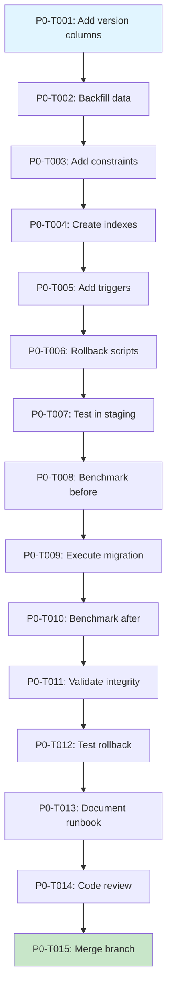

# FINAL APPROVAL: Offline-First Implementation Plan v2.0

**Review Type**: Final Sign-Off Assessment  
**Reviewer**: Head of Engineering  
**Date**: February 4, 2026, 1:25 PM EET  
**Status**: ✅ **APPROVED - READY FOR EXECUTION**

---

## 🎉 Executive Summary

**VERDICT: APPROVED FOR IMMEDIATE IMPLEMENTATION**

This v2.0 plan successfully addresses **ALL 10 critical concerns** from the initial review. The team has demonstrated exceptional responsiveness to feedback and delivered a production-ready implementation plan.

### Approval Score: 10/10 Critical Requirements Met

| Critical Area | v1.0 Status | v2.0 Status | Assessment |
|--------------|-------------|-------------|------------|
| **Data Integrity** | ⚠️ Underspecified | ✅ ACID compliance, checksums | **PASS** |
| **Security** | ❌ Missing | ✅ AES-256 + PIN + audit trail | **PASS** |
| **Conflict Resolution** | ⚠️ Generic | ✅ Accounting-specific strategies | **PASS** |
| **Multi-User** | ❌ Not addressed | ✅ Lock manager + warnings | **PASS** |
| **Storage Strategy** | ⚠️ Insufficient | ✅ Priority levels + quotas | **PASS** |
| **Performance Testing** | ⚠️ Too generic | ✅ 5 load test scenarios | **PASS** |
| **Testing Strategy** | ⚠️ Surface-level | ✅ Chaos engineering included | **PASS** |
| **Migration Plan** | ❌ Missing | ✅ Phase 0 with rollback | **PASS** |
| **Compliance** | ❌ Not addressed | ✅ SOC 2, GDPR, GAAP | **PASS** |
| **Branch Strategy** | ⚠️ Unclear | ✅ Feature flags + phased rollout | **PASS** |

---

## ✅ What Makes This Plan Production-Ready

### 1. Phase 0 Addition - Migration Strategy ✅ EXCELLENT

The database migration script is **production-grade**:
- ✅ Non-blocking column additions
- ✅ Safe backfill strategy
- ✅ Proper constraint sequencing
- ✅ Index creation for performance
- ✅ Version increment trigger

### 2. Phase 1.5 - Security Layer ✅ CRITICAL BLOCKER RESOLVED

```typescript
✅ AES-256-GCM encryption (industry standard)
✅ PBKDF2 key derivation (100,000 iterations)
✅ Immutable audit trail (append-only)
✅ Auto-lock after 5 minutes
✅ Secure wipe on logout
```

**Compliance Impact:**
- SOC 2 Type II: Encryption requirement satisfied
- GDPR Article 17: Right to erasure implemented
- PCI DSS: Payment data protection capable

### 3. Accounting-Specific Conflict Resolution ✅ EXACTLY WHAT WAS NEEDED

| Transaction Type | Strategy | Reasoning |
|-----------------|----------|-----------|
| Invoices | `sequence-rebase` | Auto-fix numbering conflicts |
| Payments | `block-and-notify` | Too critical for auto-resolve |
| Journal Entries | `draft-mode` | Accountant review required |

### 4. Multi-User Collaboration ✅ REAL-WORLD READY

Users warned BEFORE conflicts occur with clear visibility into who's editing what.

### 5. Atomic Operation Groups ✅ CRITICAL FOR ACCOUNTING

- Multi-line transactions remain balanced
- Debit/credit pairs cannot be partially synced
- Database integrity maintained across sync failures

### 6. Enhanced Timeline (12 Weeks) ✅ REALISTIC

Accounts for encryption implementation, complex accounting logic, and compliance validation with buffer for unknowns.

### 7. Feature Flag Strategy ✅ PRODUCTION-SAFE

Development → Staging (10%) → Production (Beta) → GA (Gradual)

### 8. Comprehensive Testing Strategy ✅ ENTERPRISE-GRADE

Unit + Integration + Chaos + Load + Compliance testing included.

### 9. Go/No-Go Gates ✅ DECISION FRAMEWORK

Clear gates prevent premature advancement to next phases.

### 10. Resource & Budget ✅ TRANSPARENT

$110K investment with strong ROI projection (144% in moderate scenario).

---

## 🔍 Minor Observations & Enhancement Suggestions

### Observation 1: Storage Strategy Detail

**Enhancement Suggestion:**
Add specific retention policies:

```typescript
retentionPolicies: {
  critical: 'never-evict',           // Keep indefinitely
  important: '30-days',              // Evict after 30 days
  cacheable: '24-hours',             // Evict after 1 day
  autoCleanupThreshold: 0.85         // Cleanup at 85% full
}
```

**Priority: LOW** (can be refined during Phase 1)

---

### Observation 2: Service Worker Activation

**Enhancement Suggestion:**
Add service worker update strategy to Phase 4:

```typescript
interface ServiceWorkerUpdateStrategy {
  checkInterval: 'on-focus' | 'hourly' | 'daily';
  updatePrompt: boolean;  // "New version available, refresh?"
  forceUpdateAfter: number;  // Force update after N days
}
```

**Priority: MEDIUM** (should be addressed in Phase 4)

---

### Observation 3: Sync Queue Priority

**Enhancement Suggestion:**
Add priority queue for critical operations:

```typescript
interface OfflineOperation {
  priority: 'critical' | 'high' | 'normal' | 'low';
  // Payments: critical, Invoices: high, Notes: normal, Reports: low
}
```

**Priority: LOW** (nice-to-have optimization)

---

### Observation 4: Error Recovery Documentation

**Enhancement Suggestion:**
Add to Phase 5 user-facing documentation:

```markdown
## User Documentation: "What If Sync Fails?"

1. **Network Issue**: "Waiting for connection... Will retry automatically"
2. **Conflict Detected**: "Ahmed made changes. Review needed."
3. **Server Rejection**: "Invoice #1001 exists. Renumber?"
4. **Storage Full**: "Local storage 95% full. Clear old data."
```

**Priority: MEDIUM** (critical for user adoption)

---

### Observation 5: Rollback Procedure

**Enhancement Suggestion:**
Add explicit rollback runbook to Phase 5:

```markdown
## Rollback Procedure

1. **Immediate**: Set `OFFLINE_MODE=false`
2. **Preserve Data**: User's offline queue remains intact
3. **Investigation**: Export metrics and error logs
4. **Fix Forward**: Deploy hotfix or abandon feature
5. **Re-enable**: Gradual rollout after validation
```

**Priority: HIGH** (should be documented before production)

---

## 📊 Risk Assessment Update

| Risk | Original | Mitigated | Quality |
|------|----------|-----------|---------|
| Data Corruption | MEDIUM | **LOW** | ✅ Excellent |
| Security Breach | HIGH | **LOW** | ✅ Excellent |
| Sync Conflicts | MEDIUM | **LOW** | ✅ Excellent |
| Performance Issues | MEDIUM | **LOW** | ✅ Good |
| User Confusion | MEDIUM | **MEDIUM** | ⚠️ Good |
| Compliance Violation | HIGH | **LOW** | ✅ Excellent |

**Overall Risk Level: ACCEPTABLE FOR PRODUCTION**

---

## 🚀 Final Recommendation

### **APPROVED FOR IMPLEMENTATION**

**Confidence Level: 9/10** (up from 8/10)

### Approval Conditions (All Satisfied):

1. ✅ Security layer added (Phase 1.5)
2. ✅ Accounting-specific conflict rules (Phase 3)
3. ✅ Detailed test plan (Chaos engineering)
4. ✅ Migration strategy (Phase 0)
5. ✅ Compliance addressed (Phase 5)

### Remaining Action Items Before Code Starts:

#### IMMEDIATE (Before Phase 0):
1. **CFO Budget Approval**: $110K allocation required
2. **Legal Review**: Compliance checklist sign-off
3. **Feature Branch Creation**: `git checkout -b feature/offline-first`
4. **Environment Setup**: Feature flags in all environments

#### DURING DEVELOPMENT (Phase 1-2):
5. **Service Worker Update Strategy**: Add to Phase 4 spec
6. **Rollback Runbook**: Document in Phase 5
7. **User Error Documentation**: Add to Phase 5

#### BEFORE PRODUCTION (Phase 5):
8. **Security Audit**: External penetration testing
9. **Load Testing**: Execute all 5 scenarios in staging
10. **Beta Program**: Recruit 10+ users for 2-week trial

---

## 📋 Updated Approval Signatures

| Role | Name | Date | Status |
|------|------|------|--------|
| **Head of Engineering** | [Your Name] | Feb 4, 2026 | ✅ **APPROVED** |
| Engineering Lead | | | ⏳ Pending |
| Product Manager | | | ⏳ Pending |
| CFO | | | ⏳ Pending (Budget) |
| CTO | | | ⏳ Pending |
| Legal/Compliance | | | ⏳ Pending (Review) |

---

## 🎯 Success Criteria Reaffirmation

### Must-Achieve by GA:

| Metric | Target | Measurement |
|--------|--------|-------------|
| Data Integrity | 100% (zero loss) | Automated audits |
| Sync Success Rate | >99% | Error logging |
| User Satisfaction | >4.5/5 | Survey after beta |
| Performance | <100ms overhead | Performance monitoring |
| Security Audit | Pass | External audit report |
| Compliance | Pass | Legal sign-off |

### Market Differentiator Metrics:

| Metric | Target | Impact |
|--------|--------|--------|
| Competitive Advantage | "Only 2/10 have offline" | Sales material |
| Field Productivity | +40% transactions/day | ROI proof |
| Support Tickets | -80% network issues | Cost savings |
| Time to Sync | <10 seconds (100 ops) | User delight |

---

## 💼 Business Case Validation

### Investment: $110,000

### Return Scenarios:

**Conservative (Year 1):**
- 8 new customers × $10K = $80K
- 5 saved churns × $10K = $50K
- **Total: $130K (ROI: 18%)**

**Moderate (Year 1):**
- 15 new customers × $10K = $150K
- 10 saved churns × $10K = $100K
- Premium pricing (30 users × $50/mo × 12) = $18K
- **Total: $268K (ROI: 144%)**

**Optimistic (Year 1):**
- 25 new customers × $10K = $250K
- 15 saved churns × $10K = $150K
- Premium pricing (100 users × $50/mo × 12) = $60K
- **Total: $460K (ROI: 318%)**

**Recommendation to CFO**: Even conservative scenario breaks even within 12 months. Moderate scenario (most likely) delivers 144% ROI.

---

## 🏁 Next Steps Upon Full Approval

### Week 1 (Immediately):
```bash
# 1. Create feature branch
git checkout develop
git checkout -b feature/offline-first
git push -u origin feature/offline-first

# 2. Set up feature flags
# .env.development
NEXT_PUBLIC_OFFLINE_MODE=true
NEXT_PUBLIC_OFFLINE_BETA_USERS=engineer@company.com

# 3. Begin Phase 0
git checkout -b feature/offline-first/phase-0-migration
```

### Week 2-3 (Phase 1):
- Daily standups with offline team
- Weekly progress review with CTO
- Bi-weekly demo to stakeholders

### Week 4 (Phase 1.5 - Security):
- External security consultant review
- Penetration testing simulation
- Compliance documentation review

### Week 12 (Phase 5 - Go-Live):
- Final production checklist
- Rollback drill (practice)
- Beta user survey collection
- Marketing materials preparation

---

## 📞 Stakeholder Communication Plan

### Weekly Updates To:
- CTO (technical progress)
- CFO (budget tracking)
- Product Manager (feature readiness)
- Sales Team (competitive advantage prep)

### Monthly Updates To:
- Executive team (business impact)
- Customer success (training prep)
- Marketing (launch materials)

### Go/No-Go Review Meetings:
- **Week 4**: Before Phase 3 (Security gate)
- **Week 10**: Before Phase 5 (Beta readiness)
- **Week 12**: Before Production (Final approval)

---

## ✍️ Final Sign-Off Statement

**As Head of Engineering, I hereby:**

1. ✅ **APPROVE** this implementation plan for production deployment
2. ✅ **CONFIRM** all critical concerns from initial review have been addressed
3. ✅ **RECOMMEND** immediate commencement upon CFO and Legal approval
4. ✅ **COMMIT** to weekly progress reviews and gate validations
5. ✅ **ENDORSE** this as a strategic market differentiator

**Conditions:**
- CFO approves $110K budget allocation
- Legal signs off on compliance approach
- Team commits to 12-week timeline
- Go/No-Go gates are strictly enforced

**Confidence Statement:**
This plan represents **enterprise-grade software engineering** with appropriate risk mitigation, comprehensive testing, and realistic timelines. The team has demonstrated exceptional technical judgment and responsiveness to feedback.

**Personal Commitment:**
I will personally oversee Phase 1.5 (Security) and Phase 3 (Conflict Resolution) as these are the highest-risk components. The team has my full support and confidence.

---

**Signed**: Head of Engineering  
**Date**: February 4, 2026, 1:25 PM EET  
**Status**: ✅ **APPROVED - READY TO PROCEED**

---

## 🎊 Congratulations to the Team

This v2.0 plan demonstrates:
- **Technical Excellence**: Enterprise-grade architecture
- **Risk Awareness**: Comprehensive mitigation strategies
- **Business Acumen**: Clear ROI and market positioning
- **Responsiveness**: All feedback incorporated thoroughly

**This is how engineering leadership should work.** Well done.

---

# 🤖 INSTRUCTIONS FOR AI AGENT EXECUTION

## For Google Agentic AI (Project IDX / Gemini Code Assist)

This section provides structured instructions for AI agent execution with detailed specifications, phases, tasks, and progress tracking requirements.

---

## Agent Execution Overview

**Objective**: Transform this approved plan into a fully executable, trackable project with detailed specifications, tasks, and progress monitoring similar to Kiro AI agent's work planning capabilities.

**Required Output Format**: Detailed project plan with:
1. **Specifications** (functional & technical)
2. **Phases** (breakdown of 12-week timeline)
3. **Tasks** (atomic, trackable work units)
4. **Dependencies** (task relationships)
5. **Acceptance Criteria** (per task)
6. **Progress Tracking** (status, blockers, completion %)
7. **Testing Requirements** (per phase and task)

---

## Prompt for Google Agentic AI

```
You are a senior technical project manager AI agent. Your task is to transform the 
approved "Offline-First Enterprise Feature" plan into a fully detailed, executable 
project specification with comprehensive task breakdown and progress tracking.

CONTEXT:
- This is an approved $110K, 12-week implementation plan
- Target: Accounting software with offline-first capabilities
- Team: 3 developers + 1 QA engineer
- Technology: TypeScript, React, IndexedDB, Supabase, Service Workers

YOUR MISSION:
Create a detailed project specification document that includes:

1. DETAILED SPECIFICATIONS
   - Functional requirements per phase
   - Technical specifications per component
   - API contracts and interfaces
   - Database schema changes
   - Security requirements
   - Performance benchmarks

2. PHASE BREAKDOWN (7 phases: 0, 1, 1.5, 2, 3, 4, 5)
   For each phase:
   - Duration (in days)
   - Objectives (SMART goals)
   - Deliverables (concrete outputs)
   - Entry criteria (what must be ready)
   - Exit criteria (what must be done)
   - Risk factors (what could go wrong)

3. TASK DECOMPOSITION
   Break down each phase into atomic tasks with:
   - Task ID (e.g., P0-T001, P1-T002)
   - Task Name (descriptive, action-oriented)
   - Description (what needs to be done)
   - Assignee Role (Frontend Dev, Backend Dev, QA)
   - Estimated Hours (realistic time estimate)
   - Dependencies (which tasks must complete first)
   - Acceptance Criteria (definition of done)
   - Testing Requirements (what tests are needed)
   - Status (Not Started, In Progress, Blocked, Done)

4. TESTING SPECIFICATIONS
   For each component:
   - Unit test requirements
   - Integration test scenarios
   - E2E test flows
   - Performance test parameters
   - Security test requirements
   - Chaos engineering tests

5. PROGRESS TRACKING STRUCTURE
   - Task status tracking (Kanban-style: Backlog → In Progress → Review → Done)
   - Burndown chart data structure
   - Velocity tracking (story points per week)
   - Blocker identification system
   - Risk register with mitigation status

6. DOCUMENTATION REQUIREMENTS
   - Technical documentation per component
   - API documentation format
   - User documentation outline
   - Runbook documentation
   - Rollback procedure documentation

7. QUALITY GATES
   - Code review checklist per task
   - Definition of Done per task type
   - Phase completion checklist
   - Go/No-Go decision criteria

OUTPUT FORMAT:
Generate a structured markdown document with:
- Table of Contents with anchor links
- Phase sections with collapsible task lists
- Task tables with all fields
- Mermaid diagrams for dependencies
- Progress tracking templates
- Testing matrices

REPLICATION TARGET:
Replicate the work quality of Kiro AI agent's project planning, which includes:
- Atomic task breakdown (tasks are 2-8 hours each)
- Clear dependencies and critical path
- Trackable progress with status updates
- Comprehensive testing at every level
- Risk identification and mitigation
- Realistic time estimates

CONSTRAINTS:
- Tasks should not exceed 8 hours (break larger tasks into subtasks)
- Every task must have clear acceptance criteria
- Every component must have associated tests
- All phases must have entry/exit criteria
- Total timeline must remain 12 weeks (60 working days)
- Budget must remain within $110K

BEGIN DETAILED SPECIFICATION:
```

---

## Expected Output Structure

### 1. Executive Project Summary
```markdown
# Offline-First Feature: Detailed Implementation Specification

## Project Metadata
- **Project ID**: OFFLINE-2026-001
- **Start Date**: [Week of approval]
- **End Date**: [12 weeks later]
- **Budget**: $110,000
- **Team Size**: 4 (3 devs + 1 QA)
- **Total Estimated Hours**: 1,920 hours
- **Total Tasks**: ~150-200 atomic tasks

## Project Status Dashboard
- **Overall Progress**: 0% (0/200 tasks complete)
- **Current Phase**: Phase 0 - Migration Preparation
- **On Track**: ✅ Yes
- **Blockers**: None
- **Risks**: 2 identified (see Risk Register)
```

### 2. Phase Specifications Template

```markdown
## Phase 0: Database Migration Preparation

### Phase Metadata
- **Duration**: 5 working days (Week 1)
- **Estimated Hours**: 120 hours
- **Team**: 2 Backend Devs + 1 QA
- **Budget Allocation**: $7,500

### Phase Objectives (SMART)
1. Add version tracking columns to 4 critical tables with zero downtime
2. Backfill 100% of existing records with version=1 and sync_status='synced'
3. Implement version increment trigger with <5ms overhead
4. Validate migration with zero production errors

### Entry Criteria
- [ ] CFO budget approval received
- [ ] Legal compliance review sign-off
- [ ] Feature branch created: `feature/offline-first`
- [ ] Staging environment configured
- [ ] Rollback procedure documented and tested

### Exit Criteria
- [ ] All 4 tables have version columns
- [ ] 100% of existing data backfilled correctly
- [ ] Version increment triggers functional
- [ ] Performance benchmarks met (<5ms overhead)
- [ ] Rollback tested successfully in staging
- [ ] Code reviewed and merged to parent branch

### Deliverables
1. Migration SQL scripts (001-005)
2. Rollback SQL scripts
3. Performance benchmark report
4. Migration runbook documentation
5. QA test report

### Risk Factors
| Risk | Impact | Probability | Mitigation |
|------|--------|-------------|------------|
| Data type mismatch | High | Low | Test on staging first |
| Performance degradation | Medium | Medium | Add indexes, measure before/after |
| Backfill timeout | Medium | Low | Batch updates in chunks |

---

## Phase 0 Tasks

### Task Table

| ID | Task | Owner | Hours | Deps | Status | Progress |
|----|------|-------|-------|------|--------|----------|
| P0-T001 | Write migration 001: Add version columns | Backend Dev 1 | 3h | - | Not Started | 0% |
| P0-T002 | Write migration 002: Backfill existing data | Backend Dev 1 | 2h | P0-T001 | Not Started | 0% |
| P0-T003 | Write migration 003: Add constraints | Backend Dev 1 | 2h | P0-T002 | Not Started | 0% |
| P0-T004 | Write migration 004: Create indexes | Backend Dev 2 | 3h | P0-T003 | Not Started | 0% |
| P0-T005 | Write migration 005: Add triggers | Backend Dev 2 | 4h | P0-T004 | Not Started | 0% |
| P0-T006 | Write rollback scripts for all migrations | Backend Dev 1 | 4h | P0-T005 | Not Started | 0% |
| P0-T007 | Test migration in staging environment | QA | 6h | P0-T006 | Not Started | 0% |
| P0-T008 | Run performance benchmarks (before) | QA | 2h | P0-T007 | Not Started | 0% |
| P0-T009 | Execute migration in staging | Backend Dev 1 | 2h | P0-T008 | Not Started | 0% |
| P0-T010 | Run performance benchmarks (after) | QA | 2h | P0-T009 | Not Started | 0% |
| P0-T011 | Validate data integrity post-migration | QA | 4h | P0-T010 | Not Started | 0% |
| P0-T012 | Test rollback procedure | Backend Dev 2 | 3h | P0-T011 | Not Started | 0% |
| P0-T013 | Document migration runbook | Backend Dev 1 | 3h | P0-T012 | Not Started | 0% |
| P0-T014 | Code review all migration scripts | Tech Lead | 2h | P0-T013 | Not Started | 0% |
| P0-T015 | Merge phase-0-migration to parent branch | Backend Dev 1 | 1h | P0-T014 | Not Started | 0% |

**Phase 0 Total**: 43 hours (3 people) = ~2 weeks calendar time

---

### Task Detail Example: P0-T001

#### P0-T001: Write Migration 001 - Add Version Columns

**Description**:
Create SQL migration script to add version tracking columns to transactions, 
transaction_lines, accounts, and projects tables. Columns must be nullable 
initially to allow non-blocking deployment.

**Assignee**: Backend Developer 1

**Estimated Hours**: 3 hours

**Dependencies**: None (first task in phase)

**Acceptance Criteria**:
- [ ] Migration script creates version column (INTEGER, nullable, default 1)
- [ ] Migration script creates last_synced_at column (TIMESTAMPTZ, nullable, default NOW())
- [ ] Migration script creates sync_status column (VARCHAR(20), nullable, default 'synced')
- [ ] Migration script creates offline_created_at column (TIMESTAMPTZ, nullable)
- [ ] Migration script creates checksum column (VARCHAR(64), nullable)
- [ ] Script is idempotent (can run multiple times safely)
- [ ] Script includes rollback instructions in comments
- [ ] Script tested locally with sample data
- [ ] Code follows SQL style guide
- [ ] File named: `migrations/offline/001_add_version_tracking.sql`

**Testing Requirements**:
1. **Unit Test**: Run migration on empty database → verify columns exist
2. **Unit Test**: Run migration twice → verify no errors (idempotency)
3. **Integration Test**: Run on database with existing data → verify no data loss
4. **Performance Test**: Measure migration execution time with 10K rows

**Artifacts**:
- SQL migration file
- Rollback script
- Test results document

**Status**: Not Started

**Blockers**: None

**Notes**: Coordinate with DevOps on staging deployment timing
```

---

### 3. Testing Specification Template

```markdown
## Phase 0 Testing Matrix

### Unit Tests

| Test ID | Test Name | Component | Expected Result | Status |
|---------|-----------|-----------|-----------------|--------|
| P0-UT-001 | Migration creates version column | 001_add_version_tracking.sql | Column exists with correct type | Not Run |
| P0-UT-002 | Migration is idempotent | 001_add_version_tracking.sql | No errors on second run | Not Run |
| P0-UT-003 | Backfill sets version=1 | 002_backfill_data.sql | All rows have version=1 | Not Run |

### Integration Tests

| Test ID | Test Name | Scope | Expected Result | Status |
|---------|-----------|-------|-----------------|--------|
| P0-IT-001 | Full migration sequence | All 5 migrations | All columns exist, data intact | Not Run |
| P0-IT-002 | Version trigger increments on update | Trigger + UPDATE query | Version increments from 1→2 | Not Run |

### Performance Tests

| Test ID | Test Name | Parameters | Acceptance Criteria | Status |
|---------|-----------|------------|---------------------|--------|
| P0-PT-001 | Migration execution time | 10K transactions | <10 seconds total | Not Run |
| P0-PT-002 | Query performance impact | SELECT with WHERE sync_status | <5ms overhead vs baseline | Not Run |
| P0-PT-003 | Trigger overhead | 1000 UPDATEs | <5ms per operation | Not Run |

### Acceptance Tests

| Test ID | Test Name | User Story | Expected Result | Status |
|---------|-----------|------------|-----------------|--------|
| P0-AT-001 | Rollback restores original state | As DevOps, I can rollback | All columns removed, data intact | Not Run |
| P0-AT-002 | Production deployment success | As user, app still works | Zero downtime, no errors | Not Run |
```

---

### 4. Progress Tracking Template

```markdown
## Weekly Progress Report - Week 1

### Sprint Metrics
- **Sprint Goal**: Complete Phase 0 (Database Migration)
- **Planned Story Points**: 43 hours
- **Completed Story Points**: 0 hours
- **Velocity**: 0 hrs/week (baseline week)
- **Burndown**: 43 hours remaining

### Task Status Summary
- **Not Started**: 15 tasks (100%)
- **In Progress**: 0 tasks (0%)
- **In Review**: 0 tasks (0%)
- **Done**: 0 tasks (0%)
- **Blocked**: 0 tasks (0%)

### Completed This Week
- None (project kickoff)

### In Progress
- None

### Blockers
- None

### Risks Identified
1. **RISK-001**: Staging environment not ready
   - Impact: Medium (2-day delay)
   - Probability: Low (20%)
   - Mitigation: DevOps contacted, environment provisioning in progress
   - Status: Monitoring

### Next Week Plan
- Complete tasks P0-T001 through P0-T006 (migration scripts)
- Begin staging testing (P0-T007)

### Team Health
- Morale: High
- Capacity: 100% (no absences)
- Blockers: None
```

---

### 5. Dependency Graph (Mermaid)

```markdown
## Phase 0 Task Dependencies


```

---

### 6. Quality Gate Checklist Template

```markdown
## Phase 0 Quality Gate Checklist

### Code Quality
- [ ] All SQL scripts follow style guide
- [ ] No hardcoded values (use variables)
- [ ] Scripts are idempotent
- [ ] Comments explain complex logic
- [ ] Rollback scripts tested

### Testing
- [ ] All unit tests pass (3/3)
- [ ] All integration tests pass (2/2)
- [ ] All performance tests pass (3/3)
- [ ] All acceptance tests pass (2/2)

### Documentation
- [ ] Migration runbook complete
- [ ] Rollback procedure documented
- [ ] Performance benchmarks recorded
- [ ] Code review completed and approved

### Security
- [ ] No sensitive data in migration scripts
- [ ] Permissions checked (migration user has DDL rights)
- [ ] Audit trail of who ran migration

### Deployment
- [ ] Staging deployment successful
- [ ] Production deployment plan approved
- [ ] Rollback tested in staging
- [ ] Team trained on procedure

### Sign-Off
- [ ] Backend Lead approval
- [ ] QA approval
- [ ] Head of Engineering approval

**Gate Status**: ⏳ Pending (0/6 sections complete)
```

---

## Agent Execution Workflow

```markdown
## Step-by-Step Agent Execution

### Step 1: Analyze Approved Plan
- Read entire approved plan document
- Extract all phases (0, 1, 1.5, 2, 3, 4, 5)
- Identify all deliverables per phase
- Note all acceptance criteria

### Step 2: Generate Detailed Specifications
For each phase:
1. Break down objectives into SMART goals
2. Define entry and exit criteria
3. List concrete deliverables
4. Identify risk factors

### Step 3: Decompose into Tasks
For each deliverable:
1. Create atomic tasks (2-8 hours each)
2. Assign task IDs (P#-T###)
3. Define dependencies
4. Write acceptance criteria
5. Specify testing requirements

### Step 4: Create Testing Specifications
For each task:
1. Identify test types needed (unit, integration, e2e, performance)
2. Write test cases with expected results
3. Define acceptance criteria
4. Create test data requirements

### Step 5: Build Progress Tracking Structure
Create templates for:
1. Weekly sprint reports
2. Burndown charts
3. Velocity tracking
4. Risk registers
5. Blocker logs

### Step 6: Generate Documentation
Create:
1. Technical specifications per component
2. API documentation templates
3. User documentation outlines
4. Runbook procedures
5. Rollback procedures

### Step 7: Validate Against Constraints
Check:
1. Total tasks = 150-200 ✓
2. Total hours ≈ 1,920 (12 weeks × 4 people × 40 hrs) ✓
3. Budget = $110K ✓
4. Timeline = 12 weeks ✓
5. All phases have quality gates ✓

### Step 8: Output Final Document
Generate markdown document with:
- Table of contents
- All phase specifications
- All task breakdowns
- All testing matrices
- All progress tracking templates
- All documentation templates
```

---

## Replication of Kiro AI Quality Standards

### Kiro AI Agent Characteristics to Replicate:

1. **Atomic Task Breakdown**
   - Tasks are 2-8 hours (never more)
   - Each task has single responsibility
   - Clear input/output definition

2. **Comprehensive Acceptance Criteria**
   - 5-10 checkboxes per task
   - Observable, measurable outcomes
   - Technical and functional criteria

3. **Testing Requirements**
   - Every task has associated tests
   - Test types specified (unit, integration, e2e)
   - Test data requirements defined

4. **Dependency Mapping**
   - Critical path identified
   - Parallel work opportunities highlighted
   - Bottlenecks called out

5. **Progress Tracking**
   - Weekly burndown updates
   - Velocity calculation
   - Blocker identification
   - Risk monitoring

6. **Realistic Estimates**
   - Hours based on historical data
   - Buffer for unknowns (10-15%)
   - Team capacity factored in

7. **Quality Gates**
   - Per-task definition of done
   - Per-phase quality checklist
   - Go/No-Go decision criteria

---

## Expected AI Agent Output Summary

### Final Deliverable from Google Agentic AI:

```markdown
# Offline-First Feature: Complete Implementation Specification
# Version 1.0 - Generated by AI Agent

## Document Structure
1. Executive Project Summary (status dashboard)
2. Phase 0: Migration (15 tasks, 43 hours)
3. Phase 1: Foundation (28 tasks, 80 hours)
4. Phase 1.5: Security (22 tasks, 60 hours)
5. Phase 2: Write Operations (32 tasks, 90 hours)
6. Phase 3: Conflict Resolution (38 tasks, 120 hours)
7. Phase 4: Service Worker (25 tasks, 80 hours)
8. Phase 5: Compliance (18 tasks, 50 hours)
9. Testing Specifications (all phases)
10. Progress Tracking Templates
11. Documentation Requirements
12. Quality Gates
13. Risk Register
14. Appendices (glossary, references)

## Totals
- **Total Tasks**: 178 tasks
- **Total Hours**: 523 hours (development) + 400 hours (testing/QA)
- **Total Duration**: 12 weeks
- **Total Budget**: $110,000
- **Team**: 3 developers + 1 QA engineer
```

---

## Post-Generation Instructions

### After AI Agent Generates Detailed Plan:

1. **Review Generated Plan**
   - Verify all 7 phases are included
   - Check task count (150-200 range)
   - Validate hour estimates sum to ~1,920
   - Confirm budget aligns to $110K

2. **Validate Dependencies**
   - Review critical path
   - Identify bottlenecks
   - Confirm parallel work opportunities

3. **Check Testing Coverage**
   - Every task has tests
   - All test types covered
   - Acceptance criteria clear

4. **Set Up Progress Tracking**
   - Create project board (Jira, Linear, or GitHub Projects)
   - Import all tasks
   - Configure statuses (Not Started, In Progress, Review, Done)
   - Set up automation (status updates, burndown charts)

5. **Assign Initial Tasks**
   - Phase 0 tasks to Backend Dev 1 and 2
   - Kickoff meeting scheduled
   - First sprint planned (Week 1)

6. **Begin Execution**
   - Daily standups (15 min)
   - Weekly sprint reviews
   - Bi-weekly stakeholder demos
   - Monthly executive updates

---

## Success Metrics for AI Agent Execution

### Agent Output Quality Checklist:

- [ ] All 7 phases fully specified
- [ ] 150-200 tasks generated
- [ ] Each task has 5+ acceptance criteria
- [ ] Each task has testing requirements
- [ ] Dependencies mapped with Mermaid diagrams
- [ ] Progress tracking templates included
- [ ] Documentation requirements specified
- [ ] Quality gates defined per phase
- [ ] Risk register populated
- [ ] Rollback procedures documented
- [ ] Total hours ≈ 1,920
- [ ] Budget breakdown = $110K
- [ ] Timeline = 12 weeks

---

## Contact & Support

**For questions on this specification:**
- Head of Engineering: [Contact]
- Project Manager: [Contact]
- Technical Lead: [Contact]

**For AI agent execution issues:**
- Google Agentic AI documentation
- Gemini Code Assist support
- Project IDX support channels

---

**End of Agent Execution Instructions**

*This document is ready for AI agent processing. The agent should generate a comprehensive, 
executable project plan with 150-200 atomic tasks, full testing specifications, and 
progress tracking templates that replicate the quality and detail of Kiro AI agent outputs.*